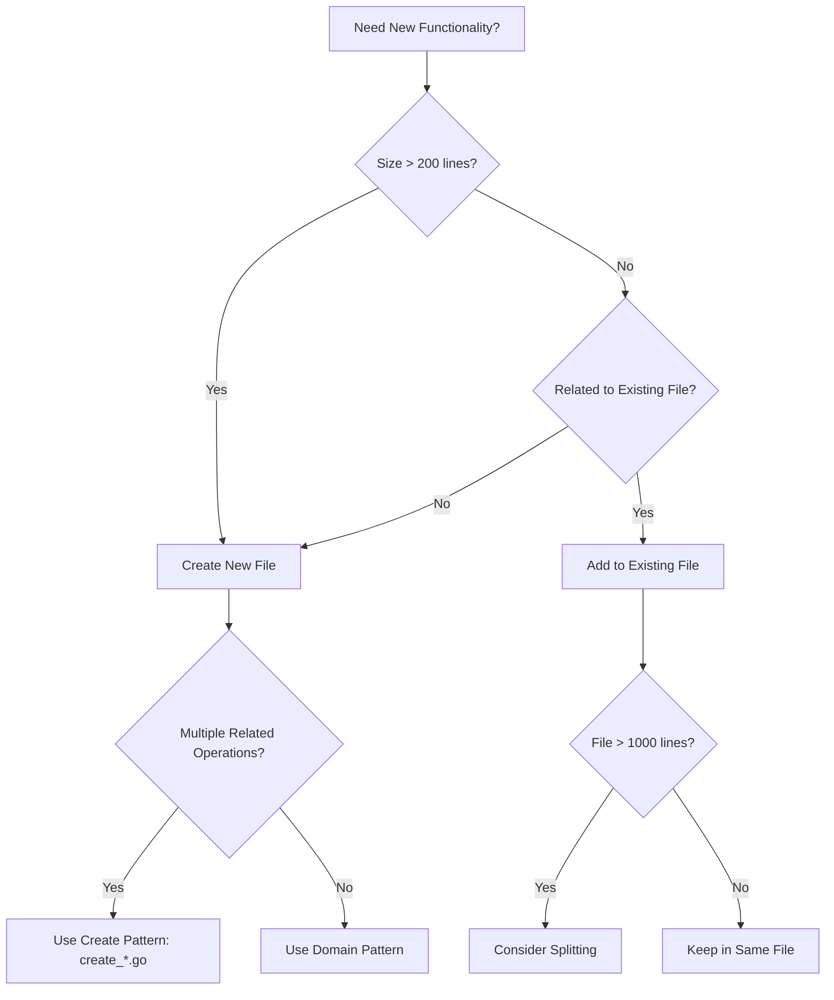
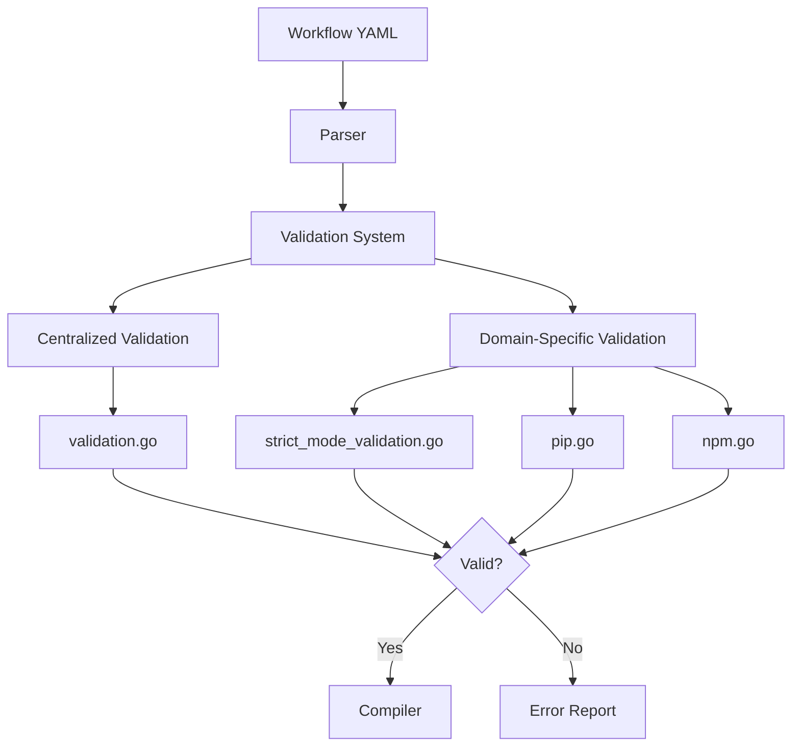
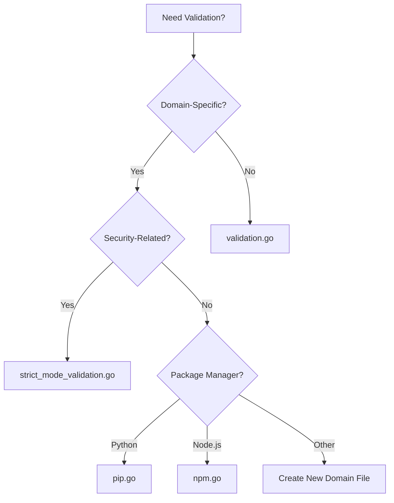
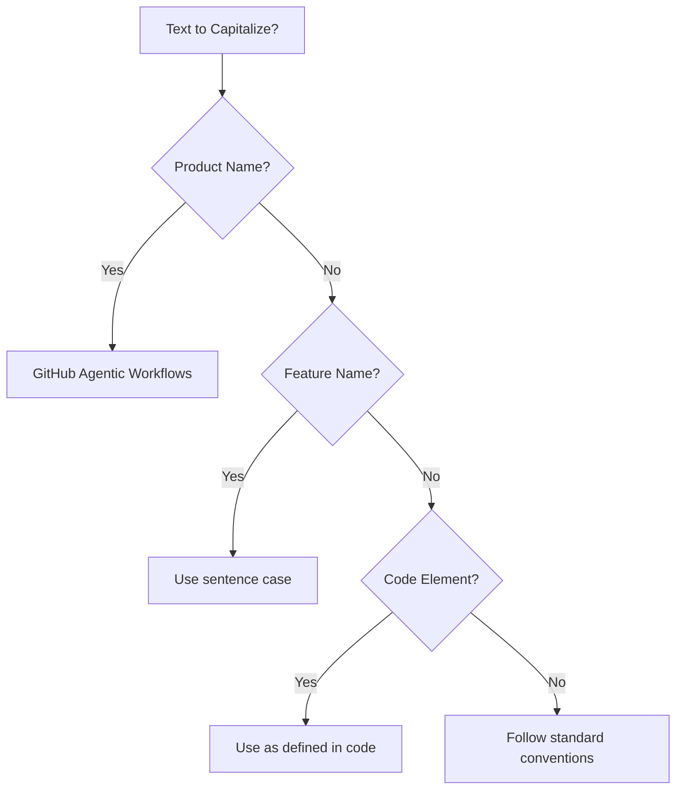
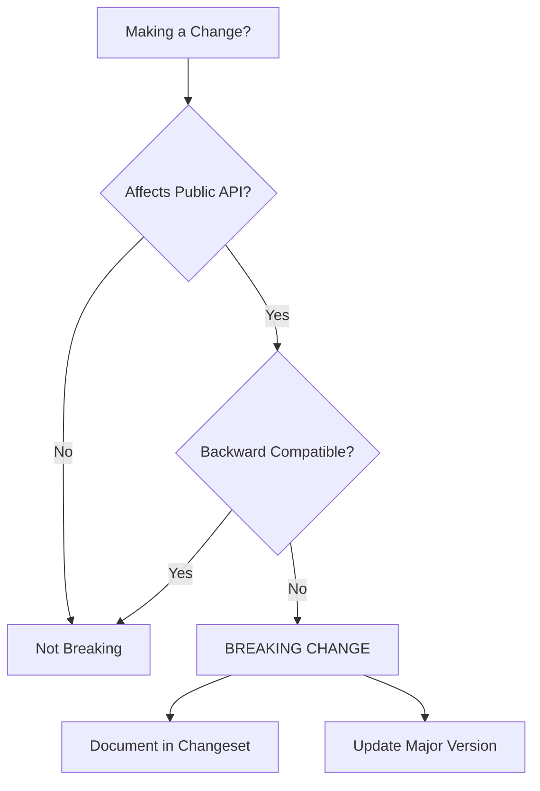
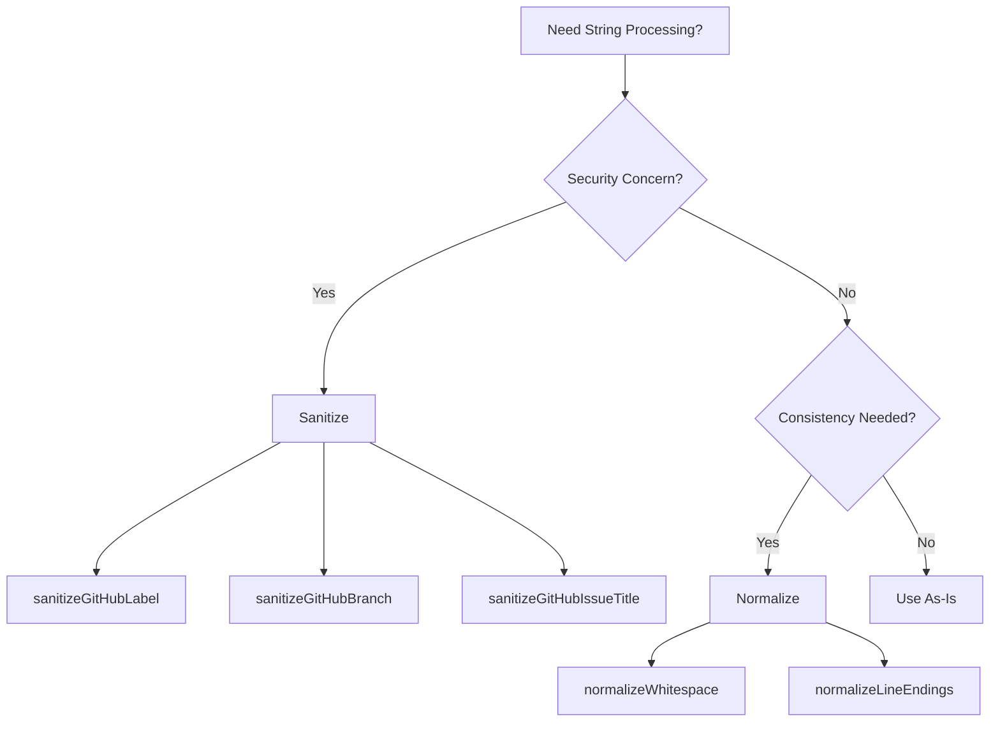
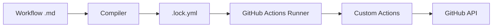
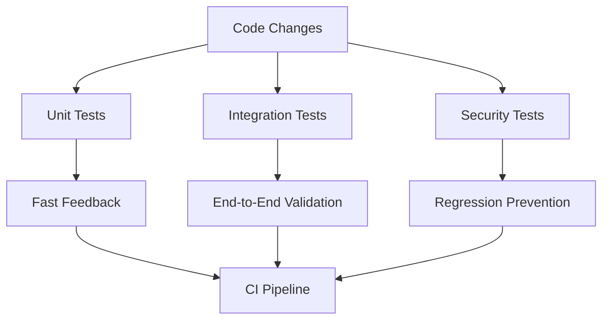
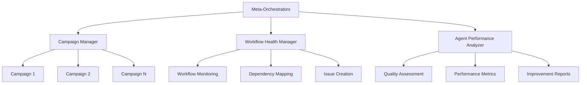

# Developer Instructions

This document consolidates development guidelines, architectural patterns, and implementation standards for GitHub Agentic Workflows. It provides comprehensive guidance for contributing to the codebase while maintaining consistency, security, and code quality.

## Table of Contents

- [Code Organization Patterns](#code-organization-patterns)
- [Validation Architecture](#validation-architecture)
- [Development Standards](#development-standards)
- [String Processing](#string-processing)
- [YAML Handling](#yaml-handling)
- [Safe Output Messages](#safe-output-messages)
- [Custom GitHub Actions](#custom-github-actions)
- [Security Best Practices](#security-best-practices)
- [Testing Framework](#testing-framework)
- [Repo-Memory System](#repo-memory-system)
- [Hierarchical Agent Management](#hierarchical-agent-management)
- [Multi-Repository Patterns](#multi-repository-patterns)
- [Release Management](#release-management)
- [Quick Reference](#quick-reference)

---

## Code Organization Patterns

### Recommended Patterns

The codebase exhibits several well-organized patterns that should be emulated:

#### 1. Create Functions Pattern (`create_*.go`)

**Pattern**: One file per GitHub entity creation operation

**Examples**:
- `create_issue.go` - GitHub issue creation logic
- `create_pull_request.go` - Pull request creation logic
- `create_discussion.go` - Discussion creation logic
- `create_code_scanning_alert.go` - Code scanning alert creation
- `create_agent_task.go` - Agent task creation logic

**Why it works**:
- Clear separation of concerns
- Enables quick location of specific functionality
- Prevents files from becoming too large
- Facilitates parallel development
- Makes testing straightforward

#### 2. Engine Separation Pattern

**Pattern**: Each AI engine has its own file with shared helpers in `engine_helpers.go`

**Examples**:
- `copilot_engine.go` (971 lines) - GitHub Copilot engine
- `claude_engine.go` (340 lines) - Claude engine
- `codex_engine.go` (639 lines) - Codex engine
- `custom_engine.go` (300 lines) - Custom engine support
- `engine_helpers.go` (424 lines) - Shared engine utilities

**Why it works**:
- Engine-specific logic is isolated
- Shared code is centralized
- Allows addition of new engines without affecting existing ones
- Clear boundaries reduce merge conflicts

#### 3. Test Organization Pattern

**Pattern**: Tests live alongside implementation files with descriptive names

**Examples**:
- Feature tests: `feature.go` + `feature_test.go`
- Integration tests: `feature_integration_test.go`
- Specific scenario tests: `feature_scenario_test.go`

**Why it works**:
- Tests are co-located with implementation
- Clear test purpose from filename
- Encourages comprehensive testing
- Separates integration from unit tests

### File Creation Decision Tree



### File Size Guidelines

- **Small (50-200 lines)**: Utilities, helpers, simple features
- **Medium (200-500 lines)**: Domain-specific logic, focused features
- **Large (500-1000 lines)**: Complex features, comprehensive implementations
- **Very Large (1000+ lines)**: Consider splitting if not cohesive

**Implementation**: See specs/code-organization.md for complete guidelines

---

## Validation Architecture

The validation system ensures workflow configurations are correct, secure, and compatible with GitHub Actions before compilation. Validation is organized into two main patterns:

1. **Centralized validation** - General-purpose validation in `validation.go`
2. **Domain-specific validation** - Specialized validation in dedicated files

### Validation Flow



### Centralized Validation: `validation.go`

**Location**: `pkg/workflow/validation.go` (782 lines)

**Purpose**: General-purpose validation that applies across the entire workflow system

**Key Validation Functions**:
- `validateExpressionSizes()` - Ensures GitHub Actions expression size limits
- `validateContainerImages()` - Verifies Docker images exist and are accessible
- `validateRuntimePackages()` - Validates runtime package dependencies
- `validateGitHubActionsSchema()` - Validates against GitHub Actions YAML schema
- `validateNoDuplicateCacheIDs()` - Ensures unique cache identifiers
- `validateSecretReferences()` - Validates secret reference syntax
- `validateRepositoryFeatures()` - Checks repository capabilities (issues, discussions)

### Domain-Specific Validation

#### Strict Mode Validation: `strict_mode_validation.go`

**Purpose**: Enforces security and safety constraints in strict mode

**Validation Functions**:
- `validateStrictMode()` - Main strict mode orchestrator
- `validateStrictPermissions()` - Refuses write permissions
- `validateStrictNetwork()` - Requires explicit network configuration
- `validateStrictMCPNetwork()` - Requires network config on custom MCP servers
- `validateStrictBashTools()` - Refuses bash wildcard tools

#### Package Validation

- **Python/pip**: `pip.go` - Validates Python package availability on PyPI
- **Node.js/npm**: `npm.go` - Validates npm packages used with npx

### Where to Add Validation



**Implementation**: See specs/validation-architecture.md for complete architecture

---

## Development Standards

### Capitalization Guidelines



**Rules**:
- **Product Name**: "GitHub Agentic Workflows" (always capitalize)
- **Feature Names**: Use sentence case (e.g., "safe output messages")
- **File Names**: Use lowercase with hyphens (e.g., `code-organization.md`)
- **Code Elements**: Follow language conventions (e.g., `camelCase` in JavaScript, `snake_case` in Python)

**Implementation**: See specs/capitalization.md and `cmd/gh-aw/capitalization_test.go`

### Breaking Change Rules



**Breaking Changes**:
- Removing or renaming CLI commands, flags, or options
- Changing default behavior that users depend on
- Removing support for configuration formats
- Changing exit codes or error messages that tools parse

**Non-Breaking Changes**:
- Adding new optional flags or commands
- Adding new output formats
- Internal refactoring with same external behavior
- Adding new features that don't affect existing functionality

**Implementation**: See specs/breaking-cli-rules.md for complete rules

---

## String Processing

### Sanitize vs Normalize



**Sanitize**: Remove or replace characters that could cause security issues or break GitHub API constraints

**Key Functions**:
- `sanitizeGitHubLabel()` - Ensures labels meet GitHub requirements (no emoji, length limits)
- `sanitizeGitHubBranch()` - Validates branch names against Git ref rules
- `sanitizeGitHubIssueTitle()` - Ensures issue titles don't contain problematic characters

**Normalize**: Standardize format for consistency without security implications

**Key Functions**:
- `normalizeWhitespace()` - Standardizes whitespace (spaces, tabs, newlines)
- `normalizeLineEndings()` - Converts CRLF to LF
- `normalizeMarkdown()` - Standardizes markdown formatting

**Implementation**: See specs/string-sanitization-normalization.md and `pkg/workflow/strings.go`

---

## YAML Handling

### YAML 1.1 vs 1.2 Gotchas

**Critical Issue**: GitHub Actions uses YAML 1.1, but many Go YAML libraries default to YAML 1.2

**Key Differences**:
- `on` keyword: YAML 1.1 treats as boolean `true`, YAML 1.2 treats as string
- `yes`/`no`: YAML 1.1 treats as booleans, YAML 1.2 treats as strings
- Octal numbers: Different parsing rules

**Solution**: Use `goccy/go-yaml` library which supports YAML 1.1

```go
import "github.com/goccy/go-yaml"

// Correct YAML 1.1 parsing
var workflow map[string]interface{}
err := yaml.Unmarshal(data, &workflow)
```

**Affected Keywords**:
- Workflow triggers: `on`, `push`, `pull_request`
- Boolean values: `yes`, `no`, `true`, `false`, `on`, `off`
- Null values: `null`, `~`

**Implementation**: See specs/yaml-version-gotchas.md and `pkg/workflow/compiler.go`

---

## Safe Output Messages

The safe output message system provides structured communication between AI agents and GitHub API operations.

### Message Categories

| Category | Purpose | Footer | Example |
|----------|---------|--------|---------|
| **Issues** | Create/update issues | With issue number | `> AI generated by [Workflow](url) for #123` |
| **Pull Requests** | Create/update PRs | With PR number | `> AI generated by [Workflow](url) for #456` |
| **Discussions** | Create discussions | With discussion number | `> AI generated by [Workflow](url)` |
| **Comments** | Add comments | Context-aware | `> AI generated by [Workflow](url) for #123` |

### Staged Mode Indicator

The 🎭 emoji consistently marks preview mode across all safe output types, enabling clear distinction between test runs and live operations.

### Message Structure

```yaml
safe_outputs:
  create_issue:
    title: "Issue title"
    body: |
      ## Description

      Content here

      ---
      > AI generated by [WorkflowName](run_url)
```

**Implementation**: See specs/safe-output-messages.md and `pkg/workflow/safe_outputs.go`

---

## Custom GitHub Actions

### Architecture



### Build System

The custom actions build system is **entirely implemented in Go** in `pkg/cli/actions_build_command.go`. There are no JavaScript build scripts.

**Key Commands**:
- `make actions-build` - Build all custom actions
- `make actions-validate` - Validate action configuration
- `make actions-clean` - Clean build artifacts

**Directory Structure**:
```
actions/
└── setup/
    ├── action.yml
    ├── setup.sh
    ├── js/
    └── sh/
```

**Implementation**: See specs/actions.md and `pkg/cli/actions_build_command.go`

---

## Security Best Practices

### Template Injection Prevention

**Key Rule**: Never directly interpolate user input into GitHub Actions expressions or shell commands

**Vulnerable Pattern**:
```yaml
# ❌ UNSAFE - User input in expression
- run: echo "Title: ${{ github.event.issue.title }}"
```

**Safe Pattern**:
```yaml
# ✅ SAFE - Use environment variables
- env:
    TITLE: ${{ github.event.issue.title }}
  run: echo "Title: ${TITLE}"
```

### GitHub Actions Security

**Best Practices**:
- Always pin actions to specific commit SHAs, not tags
- Use minimal permissions with `permissions:` block
- Validate all external inputs
- Never log secrets or tokens
- Use GitHub's OIDC for cloud authentication

**Example**:
```yaml
permissions:
  contents: read
  issues: write
  pull-requests: write

steps:
  - uses: actions/checkout@a1b2c3d4... # Pinned SHA
```

**Implementation**: See specs/github-actions-security-best-practices.md and specs/template-injection-prevention.md

---

## Testing Framework

### Test Strategy



### Test Types

| Test Type | Purpose | Location | Run Frequency |
|-----------|---------|----------|---------------|
| **Unit Tests** | Test individual functions | `*_test.go` | Every commit |
| **Integration Tests** | Test component interactions | `*_integration_test.go` | Pre-merge |
| **Security Regression Tests** | Prevent security issues | `security_regression_test.go` | Every commit |
| **Fuzz Tests** | Find edge cases | `*_fuzz_test.go` | Continuous |
| **Benchmark Tests** | Performance tracking | `*_benchmark_test.go` | Pre-release |

### Test Maintenance

The testing framework is designed to be:
- **Self-validating**: The validation script ensures all tests work correctly
- **Comprehensive**: Covers all aspects of functionality and interface design
- **Maintainable**: Clear structure and documentation for future updates
- **Scalable**: Tests can be added incrementally as functionality is implemented
- **Security-focused**: Security regression tests prevent reintroduction of vulnerabilities

### Visual Regression Testing

Visual regression tests ensure console output formatting remains consistent across code changes. The system uses golden files to capture expected output for table layouts, box rendering, tree structures, and error formatting.

**Golden Test Commands**:
```bash
# Run golden tests
go test -v ./pkg/console -run='^TestGolden_'

# Update golden files (only when intentionally changing output)
make update-golden
```

**Test Coverage**:
- Table rendering with various configurations
- Box formatting with different widths and content
- Tree structures for hierarchical data
- Error messages with context and suggestions
- Message formatting (success, info, warning, error)
- Layout composition and emphasis boxes

**When to Update Golden Files**:
- ✅ Intentionally improving console output formatting
- ✅ Fixing visual bugs in rendering
- ✅ Adding new columns or fields to tables
- ❌ Tests fail unexpectedly during development
- ❌ Making unrelated code changes

**Implementation**: See specs/visual-regression-testing.md and `pkg/console/golden_test.go`

---

## Repo-Memory System

The repo-memory feature provides persistent, git-backed storage for AI agents across workflow runs. Agents can maintain state, notes, and artifacts in dedicated git branches with automatic synchronization.

### Architecture Overview

```mermaid
graph TD
    A[Agent Job Start] --> B[Clone memory/{id} branch]
    B --> C[Agent reads/writes files]
    C --> D[Upload artifact: repo-memory-{id}]
    D --> E[Push Repo Memory Job]
    E --> F[Download artifact]
    F --> G[Validate files]
    G --> H[Commit to memory/{id}]
    H --> I[Push to repository]
```

### Path Conventions

| Pattern | Format | Example | Purpose |
|---------|--------|---------|---------|
| **Memory Directory** | `/tmp/gh-aw/repo-memory/{id}` | `/tmp/gh-aw/repo-memory/default` | Runtime directory for agent |
| **Artifact Name** | `repo-memory-{id}` | `repo-memory-default` | GitHub Actions artifact |
| **Branch Name** | `memory/{id}` | `memory/default` | Git branch for storage |

### Data Flow

1. **Clone Phase**: Clones `memory/{id}` branch to local directory
2. **Execution Phase**: Agent reads/writes files in memory directory
3. **Upload Phase**: Uploads directory as GitHub Actions artifact
4. **Download Phase**: Downloads artifact and validates constraints
5. **Push Phase**: Commits files to `memory/{id}` branch and pushes

### Key Configuration

```yaml
repo-memory:
  - id: default
    create-orphan: true
    allow-artifacts: true

  - id: campaigns
    create-orphan: true
    max-file-size: 1MB
    max-files: 100
```

**Validation Constraints**:
- Maximum file size limits
- Maximum file count limits
- Allowed/blocked file patterns
- Size and count tracking in commit messages

**Implementation**: See specs/repo-memory.md and `pkg/workflow/repo_memory.go`

---

## Hierarchical Agent Management

The hierarchical agent system provides meta-orchestration capabilities to manage multiple agents and workflows at scale. Specialized meta-orchestrator workflows oversee, coordinate, and optimize the agent ecosystem.

### Meta-Orchestrator Architecture



### Meta-Orchestrator Roles

| Role | File | Purpose | Schedule |
|------|------|---------|----------|
| **Workflow Health Manager** | `workflow-health-manager.md` | Monitor workflow health | Daily |
| **Agent Performance Analyzer** | `agent-performance-analyzer.md` | Analyze agent quality | Daily |

**Key Capabilities**:
- Cross-campaign coordination
- Workflow health monitoring
- Performance trend analysis
- Strategic priority management
- Proactive maintenance
- Quality assessment

**Implementation**: See specs/agents/hierarchical-agents.md and `.github/workflows/` meta-orchestrator files

---

## Multi-Repository Patterns

GitHub Agentic Workflows can coordinate automation across multiple repositories through cross-repository safe outputs and GitHub API integration. Understanding when and how to suggest multi-repository patterns helps users build scalable automation for monorepos, microservices, and shared libraries.

### Common Multi-Repository Patterns

#### 1. Monorepo Pattern

**Use Case**: Single workflow managing multiple projects or components within separate directories of the same repository.

**Repository Structure**:
```text
monorepo/
├── packages/
│   ├── service-a/
│   ├── service-b/
│   └── shared-lib/
├── .github/
│   └── workflows/
│       └── component-tester.md
```

**Workflow Configuration**:
```aw
---
on:
  push:
    branches: [main]
    paths:
      - 'packages/service-a/**'
      - 'packages/service-b/**'
permissions:
  contents: read
  issues: write
tools:
  github:
    toolsets: [repos, issues]
  bash:
    - "git:*"
    - "npm:*"
safe-outputs:
  create-issue:
    max: 5
    labels: [component-test-report]
---

# Component Test Reporter

Analyze which components changed in this push. For each modified package:
1. Identify the component from the path
2. Run tests for that component
3. Summarize test results
4. Create an issue if tests fail

Use GitHub tools to check for existing test failure issues before creating new ones.
```

**GitHub MCP Queries**:
```markdown
# List commits affecting specific component
List commits in githubnext/gh-aw that modified files in packages/service-a/

# Search for component-specific issues
Search issues in githubnext/gh-aw with label "service-a" and state "open"

# Get files changed in a commit
Get commit details for githubnext/gh-aw SHA abc123 including file changes
```

**When to Suggest**: DevOps workflows testing/deploying multiple services, PM workflows generating component-specific release notes, QA workflows running component-specific test suites.

#### 2. Microservices Pattern

**Use Case**: Coordinated workflows across independent service repositories with centralized tracking or orchestration.

**Repository Structure**:
```text
Organization: myorg
├── control-plane (central coordination)
├── auth-service
├── api-service
├── web-frontend
└── mobile-backend
```

**Workflow Configuration**:
```aw
---
on:
  issues:
    types: [opened, labeled]
permissions:
  contents: read
  actions: read
tools:
  github:
    toolsets: [repos, issues, pull_requests]
safe-outputs:
  github-token: ${{ secrets.CROSS_REPO_PAT }}
  create-issue:
    max: 10
    target-repo: "myorg/control-plane"
    title-prefix: "[tracking] "
    labels: [multi-service, tracking]
---

# Cross-Service Issue Tracker

When issues are labeled with "needs-coordination", create a tracking issue in the central control-plane repository.

Analyze the issue context:
1. Determine which services are affected
2. Query related issues in affected service repos
3. Summarize dependencies and impact
4. Create tracking issue linking to all related issues
5. Tag relevant teams
```

**GitHub MCP Queries**:
```markdown
# List recent releases across service repos
Get latest release from myorg/auth-service
Get latest release from myorg/api-service
Get latest release from myorg/web-frontend

# Search for related issues across repos
Search issues in myorg with query "is:open label:auth-integration"

# Check workflow status across services
List workflow runs for myorg/auth-service workflow "deploy.yml"
List workflow runs for myorg/api-service workflow "deploy.yml"
```

**When to Suggest**: DevOps workflows coordinating deployments across services, PM workflows tracking features spanning multiple services, QA workflows orchestrating integration tests across service boundaries.

#### 3. Shared Library Pattern

**Use Case**: Central repository changes triggering automated updates or notifications in dependent repositories.

**Repository Structure**:
```text
Organization: myorg
├── shared-ui-components (source)
├── web-app (consumer)
├── mobile-app (consumer)
└── admin-portal (consumer)
```

**Workflow Configuration**:
```aw
---
on:
  release:
    types: [published]
permissions:
  contents: read
  actions: read
tools:
  github:
    toolsets: [repos, pull_requests]
  edit:
  bash:
    - "git:*"
safe-outputs:
  github-token: ${{ secrets.CROSS_REPO_PAT }}
  create-pull-request:
    max: 5
    title-prefix: "[deps] Update shared-ui-components to "
    labels: [dependencies, automated-update]
    draft: true
---

# Propagate Shared Library Updates

When a new release of shared-ui-components is published (version ${{ github.event.release.tag_name }}):

1. Query dependent repositories (web-app, mobile-app, admin-portal)
2. For each dependent repo:
   - Check current version in package.json/requirements.txt
   - If outdated, create a PR updating to new version
   - Include release notes and breaking change warnings
   - Link to the source release

Use GitHub tools to check for existing update PRs before creating new ones.
```

**GitHub MCP Queries**:
```markdown
# Find repositories using the shared library
Search code for "shared-ui-components" in myorg repositories

# Check current version in dependent repos
Get file contents of myorg/web-app path "package.json"
Get file contents of myorg/mobile-app path "package.json"

# List existing update PRs
Search pull requests in myorg with query "is:open 'Update shared-ui-components'"
```

**Trigger Event Reference**: Use `repository_dispatch` for custom cross-repo events or `workflow_run` for triggering based on other workflow completions. See [GitHub Triggers Documentation](https://docs.github.com/en/actions/using-workflows/events-that-trigger-workflows).

**When to Suggest**: DevOps workflows propagating security patches, PM workflows notifying about API changes, QA workflows triggering integration tests in dependent repos.

### Multi-Repository Best Practices

#### Authentication
- Use `github-token: ${{ secrets.CROSS_REPO_PAT }}` with PAT having `repo`, `contents:write`, `issues:write`, `pull-requests:write` permissions
- For enhanced security, use GitHub App tokens with automatic revocation
- Scope tokens minimally to required repositories and permissions

#### GitHub MCP Toolsets
- Enable `repos` toolset for reading files and searching code across repositories
- Enable `issues` toolset for listing and searching issues
- Enable `pull_requests` toolset for managing PRs across repos
- Enable `actions` toolset for querying workflow runs and artifacts

#### Error Handling
- Validate repository access before operations using GitHub tools
- Set appropriate `max` limits on safe outputs (typically 3-10)
- Handle rate limits by spacing operations
- Provide clear error messages when cross-repo access fails

#### Cross-Repository Safe Outputs
Most safe output types support the `target-repo` parameter:
- `create-issue`: Create tracking issues in central repos
- `add-comment`: Comment on issues in other repos
- `create-pull-request`: Create PRs in downstream repos
- `create-discussion`: Create discussions in any repo
- `create-agent-session`: Create tasks in target repos

### When to Proactively Suggest Multi-Repo Patterns

**Indicators from User Requirements**:
- Mentions of "multiple repositories", "microservices", "monorepo", or "shared library"
- Coordination needs across teams or components
- Centralized tracking or reporting requirements
- Dependency management across projects

**Use Case Categories**:

1. **DevOps Workflows**
   - Deployment coordination across services
   - Security patch propagation
   - Infrastructure updates across repos
   - Monitoring and alerting aggregation

2. **PM Workflows**
   - Release notes spanning multiple components
   - Feature digest across services
   - Roadmap tracking for multi-repo projects
   - Cross-component impact analysis

3. **QA Workflows**
   - Integration testing across services
   - End-to-end test orchestration
   - Test result aggregation from multiple repos
   - Regression test coordination

**Proactive Suggestion Template**:
```markdown
Based on your requirement to [user's goal], I recommend a multi-repository pattern:

Pattern: [Monorepo/Microservices/Shared Library]
Structure: [Brief architecture description]
Key Benefits: [Why this pattern fits]
Authentication: [PAT or GitHub App recommendation]
GitHub Tools: [Required toolsets]

Would you like me to create a workflow following this pattern?
```

### Related Documentation

- [MultiRepoOps Design Pattern](../../docs/src/content/docs/guides/multirepoops.md) - Complete multi-repo guide
- [Feature Synchronization Example](../../docs/src/content/docs/examples/multi-repo/feature-sync.md) - Cross-repo sync patterns
- [Cross-Repo Issue Tracking Example](../../docs/src/content/docs/examples/multi-repo/issue-tracking.md) - Hub-and-spoke architecture
- [Safe Outputs Reference](../../docs/src/content/docs/reference/safe-outputs.md) - Cross-repo configuration
- [GitHub Workflow Events](https://docs.github.com/en/actions/using-workflows/events-that-trigger-workflows#repository_dispatch) - `repository_dispatch` trigger
- [GitHub Workflow Run Events](https://docs.github.com/en/actions/using-workflows/events-that-trigger-workflows#workflow_run) - `workflow_run` trigger

---

## Release Management

### Changesets

Use changesets to document changes and manage versioning:

```bash
# Create a changeset
npx changeset

# Release new version
npx changeset version
npx changeset publish
```

**Changeset Format**:
```markdown
---
"gh-aw": patch
---

Brief description of the change
```

**Version Types**:
- **major**: Breaking changes
- **minor**: New features (backward compatible)
- **patch**: Bug fixes and minor improvements

### End-to-End Feature Testing

For manual feature testing in pull requests:

1. Use `.github/workflows/dev.md` as test workflow
2. Add test scenarios as comments in PR
3. Dev Hawk will analyze and verify behavior
4. Do not merge dev.md changes - it remains a reusable test harness

**Implementation**: See specs/changesets.md and specs/end-to-end-feature-testing.md

---

## Quick Reference

### File Locations

| Feature | Implementation File | Test File |
|---------|-------------------|-----------|
| Validation | `pkg/workflow/validation.go` | `pkg/workflow/validation_test.go` |
| Safe Outputs | `pkg/workflow/safe_outputs.go` | `pkg/workflow/safe_outputs_test.go` |
| String Processing | `pkg/workflow/strings.go` | `pkg/workflow/strings_test.go` |
| Actions Build | `pkg/cli/actions_build_command.go` | `pkg/cli/actions_build_command_test.go` |
| Schema Validation | `pkg/parser/schemas/` | Various test files |

### Common Patterns

**Creating a new GitHub entity handler**:
1. Create `create_<entity>.go` in `pkg/workflow/`
2. Implement `Create<Entity>()` function
3. Add validation in `validation.go` or domain-specific file
4. Create corresponding test file
5. Update safe output messages

**Adding new validation**:
1. Determine if centralized or domain-specific
2. Add validation function in appropriate file
3. Call from main validation orchestrator
4. Add tests for valid and invalid cases
5. Document validation rules

**Adding new engine**:
1. Create `<engine>_engine.go` in `pkg/workflow/`
2. Implement engine interface
3. Use `engine_helpers.go` for shared functionality
4. Add engine-specific tests
5. Register engine in engine factory

---

## Additional Documentation

For detailed specifications, see individual files in `specs/`:

### Architecture & Organization
- [Code Organization Patterns](../../specs/code-organization.md)
- [Validation Architecture](../../specs/validation-architecture.md)
- [Layout System](../../specs/layout.md)
- [Go Type Patterns](../../specs/go-type-patterns.md)

### Core Features
- [Safe Output Messages Design](../../specs/safe-output-messages.md)
- [Repo-Memory System](../../specs/repo-memory.md)
- [MCP Gateway](../../specs/mcp-gateway.md)
- [MCP Logs Guardrails](../../specs/mcp_logs_guardrails.md)
- [Custom Actions Build](../../specs/actions.md)

### Testing & Quality
- [Testing Framework](../../specs/testing.md)
- [Visual Regression Testing](../../specs/visual-regression-testing.md)
- [End-to-End Feature Testing](../../specs/end-to-end-feature-testing.md)
- [Security Review](../../specs/security_review.md)
- [GoSec Integration](../../specs/gosec.md)

### Security & Standards
- [GitHub Actions Security](../../specs/github-actions-security-best-practices.md)
- [Template Injection Prevention](../../specs/template-injection-prevention.md)
- [String Sanitization](../../specs/string-sanitization-normalization.md)
- [Schema Validation](../../specs/schema-validation.md)

### Development Guidelines
- [Capitalization Guidelines](../../specs/capitalization.md)
- [Breaking Change Rules](../../specs/breaking-cli-rules.md)
- [CLI Command Patterns](../../specs/cli-command-patterns.md)
- [Styles Guide](../../specs/styles-guide.md)
- [Changesets](../../specs/changesets.md)
- [Labels](../../specs/labels.md)

### Advanced Topics
- [Hierarchical Agents](../../specs/agents/hierarchical-agents.md)
- [Hierarchical Agents Quickstart](../../specs/agents/hierarchical-agents-quickstart.md)
- [Gastown Multi-Agent Orchestration](../../specs/gastown.md)
- [mdflow Comparison](../../specs/mdflow-comparison.md)
- [mdflow Deep Research](../../specs/mdflow.md)

### Technical Details
- [YAML Version Gotchas](../../specs/yaml-version-gotchas.md)
- [Validation Refactoring](../../specs/validation-refactoring.md)
- [Workflow Refactoring Patterns](../../specs/workflow-refactoring-patterns.md)
- [Safe Output Handlers Refactoring](../../specs/safe-output-handlers-refactoring.md)
- [Artifact Naming Compatibility](../../specs/artifact-naming-compatibility.md)
- [Safe Output Environment Variables](../../specs/safe-output-environment-variables.md)

---

**Last Updated**: 2026-01-28
