GitHub Agentic Workflows hosts coding agents in [GitHub Actions](https://docs.github.com/en/actions), to perform complex, multi-step tasks automatically. This enables [Continuous AI](https://githubnext.com/projects/continuous-ai) — systematic, automated application of AI to software collaboration.

## Workflow Structure

Each workflow contains [frontmatter](/gh-aw/reference/glossary/#frontmatter) (the YAML configuration section between `---` markers) and markdown instructions. The frontmatter defines [triggers](/gh-aw/reference/triggers/) (when the workflow runs), [permissions](/gh-aw/reference/permissions/) (what it can access), and [tools](/gh-aw/reference/tools/) (what capabilities the AI has), while the markdown contains natural language task descriptions. This declarative structure enables reliable, secure agentic programming by sandboxing AI capabilities and triggering at the right moments.

```aw warp
---
on: ...
permissions: ...
tools: ...
---
# Natural Language Instructions
Analyze this issue and provide helpful triage comments...
```

## AI Engines

Workflows support **GitHub Copilot** (default), **Claude Code**, and **Codex**. Each [engine](/gh-aw/reference/engines/) (AI model/provider) interprets natural language instructions and executes them using configured tools and permissions.

## Tools and Model Context Protocol (MCP)

Workflows use [tools](/gh-aw/reference/tools/) through the **[Model Context Protocol](/gh-aw/reference/glossary/#mcp-model-context-protocol)** (MCP, a standardized protocol for connecting AI agents to external tools and services) for GitHub operations, external APIs, file operations, and custom integrations.

## Agentic vs. Traditional Workflows

**Traditional workflows** execute pre-programmed steps with fixed if/then logic. They do exactly what you tell them, every time, in the same way.

**[Agentic workflows](/gh-aw/reference/glossary/#agentic)** (workflows that have agency—the ability to make autonomous decisions) use AI to understand context, make decisions, and generate content by interpreting natural language instructions flexibly. They combine deterministic GitHub Actions infrastructure with AI-driven decision-making, adapting their behavior based on the specific situation they encounter.

## Security Design

Agentic workflows implement a defense-in-depth security architecture that protects against prompt injection, rogue MCP servers, and malicious agents. The architecture operates across multiple layers: compilation-time validation, runtime isolation, permission separation, network controls, and output sanitization.

```mermaid
flowchart LR
    INPUT["📥 Input"] --> COMPILE["🔒 Compile"]
    COMPILE --> RUNTIME["⚙️ Runtime"]
    RUNTIME --> ISOLATION["🛡️ Isolation"]
    ISOLATION --> OUTPUT["📤 Output"]
    OUTPUT --> ACTIONS["✅ Actions"]
```



Workflows run with minimal permissions (no write access by default), use tool allowlists, and process outputs through a [safety layer](/gh-aw/introduction/architecture/) before applying changes. Critical actions can require human approval. For detailed security documentation, see the [Security Architecture](/gh-aw/introduction/architecture/) page.

## Safe Inputs and Safe Outputs

- **[Safe inputs](/gh-aw/reference/safe-inputs/)** (validated user input tools) — Custom MCP tools defined inline to prevent injection attacks
- **[Safe outputs](/gh-aw/reference/safe-outputs/)** (validated GitHub operations) — Pre-approved actions the AI can request without write permissions

## Compilation

Use `gh aw compile` to generate [`.lock.yml` files](/gh-aw/reference/glossary/#workflow-lock-file-lockyml) (compiled GitHub Actions workflow files) from workflow `.md` files. The `.md` file is the editable source of truth, while `.lock.yml` is the compiled GitHub Actions workflow with security hardening. Commit both files.

## Continuous AI Patterns

Enable [Continuous AI](https://githubnext.com/projects/continuous-ai) patterns like keeping documentation current, improving code quality incrementally, intelligently triaging issues and PRs, and automating code review.

## Best Practices

Start simple and iterate with clear, specific instructions. Test workflows using `gh aw compile --watch` and `gh aw run`, monitor costs with `gh aw logs`, and review AI-generated content before merging. Use [`safe outputs`](/gh-aw/reference/safe-outputs/) (pre-approved GitHub operations) for controlled creation of issues, comments, and PRs.
