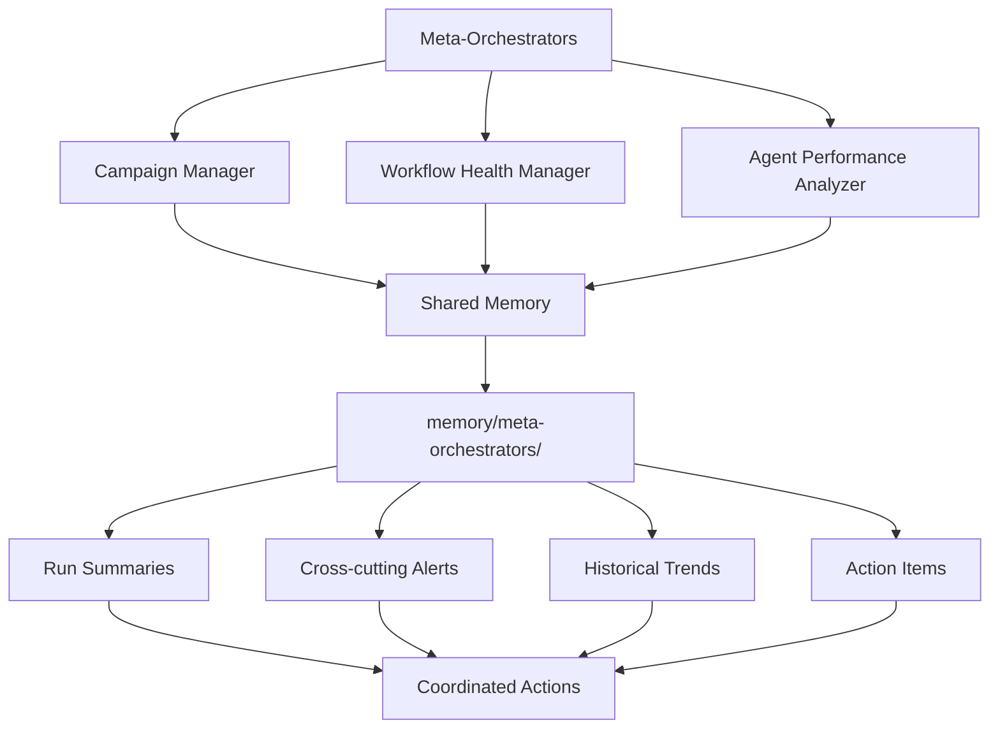

# Quick Start: Hierarchical Agents

This guide helps you quickly understand and use the new meta-orchestrator agents.

## What Are Meta-Orchestrators?

Meta-orchestrators are specialized workflows that oversee and coordinate other agents in the repository. They provide status tracking and coordination across multiple workflows.

## The Three Meta-Orchestrators

### 1. Campaign Manager
**What it does:** Manages campaign portfolio status and coordination

**When it runs:** Daily

**What you'll see:**
- Strategic discussion reports with campaign health dashboard
- Issues flagged for campaigns needing attention
- Priority adjustments on campaign project boards
- Coordination notes between related campaigns

**Example outputs:**
```markdown
# Campaign Portfolio Report - 2025-12-20

## Executive Summary
- 2 active campaigns (1 high-priority, 1 medium-priority)
- Overall completion: 45%
- Campaigns on track: 1 | Behind schedule: 1

## Campaigns Needing Attention
- Security Q1 (55/100) - Stalled, no progress in 7 days
  Issue #123 created with recommendations
```

**When to check it:** 
- Weekly during planning meetings
- When starting new campaigns
- When campaigns seem to conflict

### 2. Workflow Health Manager
**What it does:** Monitors workflow health and execution status for failures and performance issues

**When it runs:** Daily

**What you'll see:**
- Health dashboard issue (pinned) showing workflow status
- Issues created for failing workflows
- Comments on existing workflow issues with updates
- Systemic issue reports affecting multiple workflows

**Example outputs:**
```markdown
# Workflow Health Dashboard - 2025-12-20

## Critical Issues
- daily-file-diet: Failing (8/10 runs failed)
  Error: Permission denied accessing GitHub API
  Issue #456 created

## Warnings
- ci-coach: Compilation warnings
  Issue #457 created with migration guide
```

**When to check it:**
- Daily for critical issues (P0/P1)
- Before making workflow changes
- When investigating workflow failures

### 3. Agent Performance Analyzer
**What it does:** Evaluates agent output quality and effectiveness

**When it runs:** Daily

**What you'll see:**
- Performance report discussion with agent rankings
- Improvement issues for underperforming agents
- Quality trend reports
- Behavioral pattern analysis

**Example outputs:**
```markdown
# Agent Performance Report - Week of 2025-12-20

## Top Performers
1. Campaign Manager (95/100) - High quality, good effectiveness
2. CI Coach (90/100) - Clear outputs, high merge rate

## Needs Improvement
1. Workflow X (45/100)
   Issues: Incomplete outputs, high PR rejection rate
   Recommendations: Refine prompt, add quality checks
   Issue #789 created
```

**When to check it:**
- Daily during agent reviews
- When evaluating agent effectiveness
- Before creating new agents (learn from patterns)

## How They Coordinate

### Shared Memory System

All three meta-orchestrators share a common repository memory at `memory/meta-orchestrators/` where they exchange insights and coordinate actions.



**What's shared:**
- Latest run summaries from each orchestrator
- Cross-cutting alerts and coordination notes
- Historical trends and patterns
- Action items requiring multi-orchestrator attention

**How it helps:**
- **Avoid duplicates:** Campaign Manager won't create an issue if Workflow Health Manager already did
- **Better context:** Agent Performance Analyzer can see if a low-quality agent is in a failing workflow
- **Coordinated fixes:** All three can work together on systemic issues
- **Trend tracking:** Historical data enables pattern recognition across runs

**Example coordination:**
1. Workflow Health Manager detects that `daily-metrics` workflow is failing (80% failure rate)
2. Campaign Manager sees this and notes that "Metrics Campaign" relies on this workflow
3. Agent Performance Analyzer identifies the agent has quality issues in this workflow
4. Result: Single coordinated issue created referencing all three perspectives

**You don't need to do anything** - the coordination happens automatically through shared memory.

## Quick Actions

### As a Repository Maintainer

**Daily:**
1. Check Workflow Health Dashboard pinned issue for critical issues
2. Address P0/P1 issues immediately
3. Review Campaign Manager report if campaigns are active
4. Review Agent Performance Report discussion

**Weekly:**
1. Review and prioritize improvement issues
2. Update agent prompts based on recommendations

**Monthly:**
1. Review trends across all three reports
2. Adjust meta-orchestrator schedules if needed
3. Refine meta-orchestrator prompts based on learnings

### As a Workflow Author

**When creating a workflow:**
1. Check Agent Performance report for best practices
2. Review similar high-performing workflows
3. Avoid patterns flagged in health reports

**When your workflow has issues:**
1. Check if Workflow Health Manager created an issue
2. Follow recommendations in the issue
3. Comment on the issue when fixed so it gets closed

### As a Campaign Owner

**When starting a campaign:**
1. Check Campaign Manager for potential conflicts
2. Review coordination notes with related campaigns
3. Set up project board properly

**During campaign:**
1. Monitor your campaign's health score
2. Address flagged issues promptly
3. Coordinate with other campaigns as suggested

## Understanding Reports

### Health Scores

Scores are 0-100, calculated as:
- **80-100:** Healthy - No action needed
- **60-79:** Warning - Monitor closely
- **40-59:** Needs Attention - Address soon
- **0-39:** Critical - Fix immediately

### Priority Levels

Issues are tagged with priority:
- **P0 (Critical):** Fix immediately - system broken
- **P1 (High):** Fix within 1-2 days - significant impact
- **P2 (Medium):** Fix within 1-2 weeks - quality improvement
- **P3 (Low):** Fix when convenient - nice to have

### Common Labels

Look for these labels on issues:
- `workflow-health` - Created by Workflow Health Manager
- `campaign-coordination` - Created by Campaign Manager
- `agent-quality` - Created by Agent Performance Analyzer
- `priority-{p0|p1|p2|p3}` - Priority level
- `type-{failure|optimization|maintenance}` - Issue type

## Customization

### Adjusting Schedules

If reports are too frequent or not frequent enough:

```yaml
# campaign-manager.md
on: daily  # Change to: weekly, or custom schedule

# agent-performance-analyzer.md
on: daily  # Change to: weekly, biweekly, monthly
```

Recompile with: `gh aw compile <workflow>.md`

### Adjusting Safe Output Limits

If meta-orchestrators hit limits:

```yaml
safe-outputs:
  create-issue:
    max: 10  # Increase if needed
```

### Refining Prompts

Edit the workflow markdown files to:
- Focus on specific areas
- Adjust severity thresholds
- Change reporting format
- Add custom metrics

## Troubleshooting

### "No reports generated"

**Check:**
- Workflow ran successfully (GitHub Actions UI)
- GitHub MCP server accessible
- Safe outputs configured correctly
- Permissions sufficient

**Fix:**
- Review workflow run logs
- Verify GitHub API not rate limited
- Check safe output validation errors

### "Too many issues created"

**Cause:** Meta-orchestrators finding many problems

**Fix:**
1. Address the underlying issues
2. Adjust max limits in safe-outputs
3. Refine detection thresholds in prompts

### "Reports not actionable"

**Cause:** Meta-orchestrator prompt needs refinement

**Fix:**
1. Edit workflow markdown file
2. Add more specific examples
3. Include implementation guidance
4. Recompile workflow

## Best Practices

1. **Review regularly** - Don't let reports go unread
2. **Act promptly** - Address critical issues quickly
3. **Close loops** - Update issues when fixed
4. **Learn patterns** - Use insights to improve future agents
5. **Collaborate** - Share findings with team
6. **Iterate** - Refine meta-orchestrators based on experience

## Getting Help

- **Documentation:** `docs/hierarchical-agents.md`
- **Examples:** Check existing campaign orchestrators
- **Issues:** Look at issues created by meta-orchestrators for patterns
- **Discussions:** Read generated reports for insights

## Success Metrics

Track these to measure effectiveness:
- Reduction in workflow failure rates
- Improvement in agent quality scores
- Fewer campaign conflicts
- Faster issue resolution
- Better resource utilization

---

**Remember:** Meta-orchestrators are here to help, not to replace human judgment. Use their insights to make better decisions, but always apply context and expertise when acting on recommendations.
