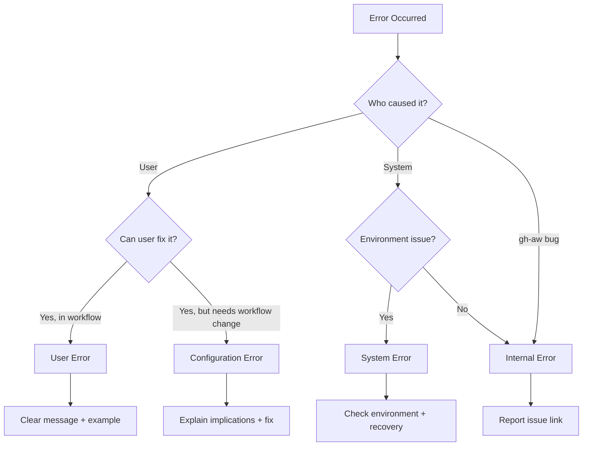

# Error Recovery Patterns

This document provides comprehensive guidance for error handling, common error scenarios, recovery strategies, and debugging techniques in GitHub Agentic Workflows (gh-aw).

## Table of Contents

1. [Error Handling Patterns](#error-handling-patterns)
2. [Common Error Scenarios](#common-error-scenarios)
3. [Error Message Templates](#error-message-templates)
4. [Debugging Runbook](#debugging-runbook)
5. [Error Categorization](#error-categorization)

---

## Error Handling Patterns

### Console Formatting Requirements

All user-facing error messages **must** use console formatting helpers from the `pkg/console` package. This ensures consistent styling and proper output routing.

**✅ CORRECT - Use console formatting:**
```go
import "github.com/githubnext/gh-aw/pkg/console"

// Error messages
fmt.Fprintln(os.Stderr, console.FormatErrorMessage(err.Error()))

// Success messages
fmt.Fprintln(os.Stderr, console.FormatSuccessMessage("Workflow compiled successfully"))

// Info messages
fmt.Fprintln(os.Stderr, console.FormatInfoMessage("Processing workflow..."))

// Warning messages
fmt.Fprintln(os.Stderr, console.FormatWarningMessage("File has uncommitted changes"))
```

**❌ INCORRECT - Plain error output:**
```go
// Don't use plain fmt.Println
fmt.Println("Error:", err)

// Don't use plain fmt.Fprintf without console formatting
fmt.Fprintf(os.Stderr, "Error: %v\n", err)
```

**Key rules:**
- **ALWAYS** use `fmt.Fprintln(os.Stderr, ...)` or `fmt.Fprintf(os.Stderr, ...)` for CLI logging
- **NEVER** use `fmt.Println()` or `fmt.Printf()` directly - all output should go to stderr
- Use console formatting helpers with `os.Stderr` for consistent styling
- For simple messages without console formatting: `fmt.Fprintf(os.Stderr, "message\n")`
- **Exception**: JSON output goes to stdout, all other output to stderr

**Available console formatters:**
```go
console.FormatSuccessMessage(msg)    // ✓ prefix, green
console.FormatInfoMessage(msg)       // ℹ prefix, blue
console.FormatWarningMessage(msg)    // ⚠ prefix, yellow
console.FormatErrorMessage(msg)      // ✗ prefix, red
console.FormatCommandMessage(cmd)    // $ prefix, dim
console.FormatProgressMessage(msg)   // ⋯ prefix
console.FormatPromptMessage(msg)     // ? prefix
console.FormatCountMessage(msg)      // # prefix
console.FormatVerboseMessage(msg)    // dim text
console.FormatLocationMessage(loc)   // @ prefix
```

**Error messages with suggestions:**
```go
suggestions := []string{
    "Check that the workflow file exists",
    "Verify the YAML syntax is correct",
    "Ensure required fields are present",
}
fmt.Fprintln(os.Stderr, console.FormatErrorWithSuggestions(
    "Failed to compile workflow",
    suggestions,
))
```

### Error Wrapping with `%w`

Use `%w` to wrap errors when preserving the error chain is important for downstream code. However, when presenting errors to users, break the chain to avoid exposing internal error types.

**Internal error handling (preserve chain):**
```go
// When error needs to be checked with errors.Is or errors.As
func processConfig(file string) error {
    data, err := os.ReadFile(file)
    if err != nil {
        // Wrap with %w to preserve error type for os.IsNotExist checks
        return fmt.Errorf("failed to read config file: %w", err)
    }
    return nil
}
```

**User-facing error handling (break chain):**
```go
// When presenting error to user
func compileWorkflow(file string) error {
    config, err := loadConfig(file)
    if err != nil {
        // Format error for user, then create new error (breaks chain)
        msg := console.FormatErrorMessage(err.Error())
        fmt.Fprintln(os.Stderr, msg)
        // Create new error without %w to prevent internal types from leaking
        return fmt.Errorf("compilation failed")
    }
    return nil
}
```

**Why break the error chain for users?**

Internal error types (like `yaml.TypeError`, `os.PathError`) are implementation details that should not leak to user-facing error messages. Breaking the chain with `errors.New()` or `fmt.Errorf()` (without `%w`) prevents downstream code from making assumptions about internal error types.

See `pkg/workflow/error_wrapping_test.go` for comprehensive examples of error wrapping patterns.

**Key rules:**
- Use `%w` for internal errors that need type checking
- Use `%s` or `errors.New()` for user-facing errors to break the chain
- Always preserve context (file names, field names) in error messages
- Never expose internal error types (`yaml.TypeError`, `os.PathError`, etc.) to users

### Debug Logging Standards

Use the logger package for debug logging. Debug logs are only shown when the `DEBUG` environment variable matches the logger's namespace.

**Creating a logger:**
```go
import "github.com/githubnext/gh-aw/pkg/logger"

// Use pkg:filename convention for namespace
var log = logger.New("workflow:compiler")
```

**Logging debug messages:**
```go
// Simple message
log.Print("Starting compilation")

// Formatted message
log.Printf("Processing %d workflows", count)

// Check if enabled before expensive operations
if log.Enabled() {
    result := expensiveOperation()
    log.Printf("Result: %+v", result)
}
```

**Enabling debug logs:**
```bash
# Enable all debug logs
DEBUG=* gh aw compile workflow.md

# Enable specific package
DEBUG=workflow:* gh aw compile workflow.md

# Enable multiple packages
DEBUG=workflow:*,cli:* gh aw compile workflow.md

# Exclude specific loggers
DEBUG=*,-workflow:test gh aw compile workflow.md

# Disable colors (auto-disabled when piping)
DEBUG_COLORS=0 DEBUG=* gh aw compile workflow.md
```

**Category naming convention:**
- Pattern: `pkg:filename` (e.g., `cli:compile_command`, `workflow:compiler`)
- Use colon (`:`) as separator between package and file/component name
- Be consistent with existing loggers in the codebase

**Key features:**
- Zero overhead when disabled (checked at logger construction)
- Time diff shown between log calls (e.g., `+50ms`, `+2.5s`)
- Auto-colors for each namespace in terminals
- Pattern matching with wildcards and exclusions

See `pkg/logger/README.md` for complete documentation.

### Panic Recovery

Panics should be rare and only used for programming errors detected at initialization time. Never panic in user-facing code paths.

**When to panic:**
- ✅ Embedded resource loading failure (schemas, action pins)
- ✅ JSON unmarshaling of hardcoded data structures
- ✅ Test setup failures in test helpers
- ✅ Programmer errors in test code

**When NOT to panic:**
- ❌ User input validation errors
- ❌ File I/O errors
- ❌ Network errors
- ❌ Configuration errors
- ❌ Any runtime error that users might encounter

**Examples of appropriate panic usage:**
```go
// Embedded schema loading (happens once at startup)
//go:embed schemas/workflow.json
var workflowSchema string

func init() {
    if workflowSchema == "" {
        panic("failed to load embedded workflow schema")
    }
}

// Test setup helper (test code only)
func mustCreateTempFile(t *testing.T, content string) string {
    tmpDir := t.TempDir()
    file := filepath.Join(tmpDir, "test.md")
    if err := os.WriteFile(file, []byte(content), 0644); err != nil {
        panic(fmt.Sprintf("test setup failed: %v", err))
    }
    return file
}
```

**Panic examples in the codebase:**
- `pkg/workflow/action_pins.go:51` - Failed to load embedded action pins
- `pkg/workflow/permissions_validator.go:47` - Failed to parse embedded permissions JSON
- `pkg/testutil/tempdir.go:30` - Test directory creation failed

---

## Common Error Scenarios

This section covers common errors users encounter, their causes, and step-by-step recovery procedures.

### MCP Configuration Errors

#### Scenario: Missing Required Fields

**Error:**
```
✗ tool 'my-server' has invalid MCP configuration: tool 'my-server' mcp configuration must specify either 'command' or 'container'
```

**Cause:** MCP server configuration is missing the required execution method.

**Resolution:**
```yaml
# Add either 'command' or 'container' field
tools:
  my-server:
    command: "npx @my/server"  # For stdio-based MCP
    # OR
    container: "ghcr.io/my-org/server:latest"  # For containerized MCP
```

**Related validation:** `pkg/workflow/mcp_config_validation.go`

#### Scenario: HTTP MCP with Container Field

**Error:**
```
✗ tool 'http-server' validation failed: http MCP servers cannot use 'container' field
```

**Cause:** HTTP-type MCP servers don't support container execution - they connect to existing HTTP endpoints.

**Resolution:**
```yaml
# Remove 'container' field for HTTP servers
tools:
  http-server:
    type: http
    url: "https://api.example.com"
    # Remove: container: "..."
```

**Related validation:** `pkg/workflow/mcp_config_validation.go`

#### Scenario: MCP Type Inference Confusion

**Error:**
```
✗ tool 'my-server' validation failed: missing required field 'url' for http type
```

**Cause:** The validator inferred HTTP type from the configuration, but the URL is missing.

**Resolution:**

Either add the URL for HTTP type:
```yaml
tools:
  my-server:
    type: http
    url: "https://api.example.com"
```

Or switch to stdio type:
```yaml
tools:
  my-server:
    command: "node server.js"
```

**Debug steps:**
1. Enable debug logging: `DEBUG=workflow:mcp_config_validation gh aw compile workflow.md`
2. Check which type was inferred
3. Add explicit `type: stdio` or `type: http` to avoid confusion

### Permission Validation Errors

#### Scenario: Write Permissions in Strict Mode

**Error:**
```
✗ strict mode: write permission 'contents: write' is not allowed for security reasons
```

**Cause:** Strict mode (`--strict` flag) refuses write permissions to prevent security risks.

**Resolution:**

Use safe outputs instead of direct write permissions:
```yaml
# Remove write permissions
permissions:
  contents: read  # Change write to read

# Use safe outputs for write operations
safe-outputs:
  create-issue:
    title: "Result"
    body: "Workflow completed"
```

**Available safe output operations:**
- `create-issue` - Create GitHub issues
- `create-pull-request` - Create pull requests
- `add-comment` - Add comments to issues/PRs
- `update-issue` - Update existing issues

**Related validation:** `pkg/workflow/strict_mode_validation.go`

#### Scenario: Missing Permissions for GitHub Toolset

**Error:**
```
✗ validation failed: GitHub tool requires additional permissions: issues: write, pull-requests: write
```

**Cause:** The GitHub MCP toolset requires specific permissions that aren't granted.

**Resolution:**
```yaml
# Add required permissions
permissions:
  contents: read
  issues: write           # Add this
  pull-requests: write    # Add this

tools:
  github:
    mode: remote
    toolsets: [issues, pull_requests]
```

**Debug steps:**
1. Check which toolsets are enabled
2. Review required permissions in error message
3. Add missing permissions to `permissions:` section

**Related validation:** `pkg/workflow/permissions_validator.go`

### Network/Firewall Errors

#### Scenario: Wildcard Network Access in Strict Mode

**Error:**
```
✗ strict mode: wildcard '*' is not allowed in network.allowed domains to prevent unrestricted internet access
```

**Cause:** Strict mode requires explicit domain allowlisting instead of wildcard access.

**Resolution:**
```yaml
# Replace wildcard with explicit domains
network:
  allowed:
    - "api.github.com"
    - "registry.npmjs.org"
    # Or use ecosystem identifiers
    - "python"  # Allows PyPI and related domains
    - "node"    # Allows npm registry
```

**Available ecosystem identifiers:**
- `python` - PyPI, python.org
- `node` - npm registry
- `containers` - Docker Hub, GitHub Container Registry
- `go` - pkg.go.dev, proxy.golang.org

**Related validation:** `pkg/workflow/strict_mode_validation.go`

#### Scenario: Network Access Required but Not Configured

**Error:**
```
✗ MCP server 'my-server' requires network access but network configuration is missing
```

**Cause:** Custom MCP server needs network access, but no network permissions are configured.

**Resolution:**
```yaml
# Add network configuration
network:
  allowed:
    - "api.example.com"  # Add required domains

tools:
  my-server:
    command: "node server.js"
```

**Debug steps:**
1. Identify which domains the MCP server needs to access
2. Add those domains to `network.allowed`
3. Test with `--strict` flag to ensure configuration is correct

### Workflow Compilation Errors

#### Scenario: Invalid YAML Syntax in Frontmatter

**Error:**
```
✗ failed to parse workflow frontmatter: invalid YAML syntax
```

**Cause:** The YAML frontmatter contains syntax errors.

**Resolution:**

1. Check for common YAML syntax errors:
   - Incorrect indentation (must use spaces, not tabs)
   - Missing colons after keys
   - Unquoted strings with special characters
   - Mismatched brackets/braces

2. Use a YAML validator to check syntax:
   ```bash
   # Extract frontmatter and validate
   head -n 20 workflow.md | grep -v '^---$' | yamllint -
   ```

3. Common fixes:
   ```yaml
   # ❌ WRONG - tabs for indentation
   tools:
   	github:
   		mode: remote
   
   # ✅ CORRECT - spaces for indentation
   tools:
     github:
       mode: remote
   
   # ❌ WRONG - missing colon
   tools
     github:
       mode: remote
   
   # ✅ CORRECT - colon after key
   tools:
     github:
       mode: remote
   ```

**Related validation:** `pkg/parser/frontmatter.go`

#### Scenario: YAML 1.1 vs 1.2 Issues

**Error:**
```
✗ unexpected value for 'on' field: true (boolean)
```

**Cause:** GitHub Actions uses YAML 1.1, where `on` is parsed as boolean `true` instead of string "on".

**Resolution:**

Quote the `on` keyword:
```yaml
# ❌ WRONG - YAML 1.1 parses 'on' as boolean
on:
  issues:
    types: [opened]

# ✅ CORRECT - quote 'on' to force string interpretation
"on":
  issues:
    types: [opened]
```

**Other YAML 1.1 keywords to quote:**
- `yes`, `no` (parsed as booleans)
- `on`, `off` (parsed as booleans)
- Numbers starting with 0 (parsed as octal)

See `scratchpad/yaml-version-gotchas.md` for complete guide.

#### Scenario: Expression Size Limit Exceeded

**Error:**
```
✗ GitHub Actions expression exceeds size limit: 21000/20000 bytes
```

**Cause:** A single GitHub Actions expression is too large (limit is 20KB per expression).

**Resolution:**

1. Split large expressions into multiple steps:
   ```yaml
   # ❌ WRONG - one huge expression
   - run: |
       ${{ very.long.expression.that.exceeds.20KB }}
   
   # ✅ CORRECT - split into multiple steps
   - name: Part 1
     run: ${{ expression.part1 }}
   - name: Part 2
     run: ${{ expression.part2 }}
   ```

2. Use environment variables to break up complex logic:
   ```yaml
   - env:
       DATA: ${{ toJSON(github.event) }}
     run: |
       echo "$DATA" | jq '.issue.title'
   ```

**Related validation:** `pkg/workflow/validation.go:validateExpressionSizes()`

#### Scenario: Invalid Engine Specified

**Error:**
```
✗ invalid engine: 'chatgpt'. Valid engines are: copilot, claude, codex, custom
```

**Cause:** The specified engine is not supported.

**Resolution:**
```yaml
# Use a valid engine
engine: copilot  # or claude, codex, custom
```

**Available engines:**
- `copilot` - GitHub Copilot (default)
- `claude` - Anthropic Claude
- `codex` - OpenAI Codex
- `custom` - Custom engine configuration

**Related validation:** `pkg/workflow/engine_validation.go`

---

## Error Message Templates

This section provides templates for writing clear, actionable error messages. Follow these templates when adding new validation or error handling.

### Validation Error Template

**Pattern:** `[what's wrong]. [what's expected]. [example of correct usage]`

**Template:**
```go
return fmt.Errorf(
    "invalid %s: %s. Expected %s. Example: %s",
    fieldName, actualValue, expectedFormat, exampleUsage,
)
```

**Example:**
```go
return fmt.Errorf(
    "invalid engine: %s. Valid engines are: copilot, claude, codex, custom. Example: engine: copilot",
    engineID,
)
```

**Key elements:**
- State what's wrong (invalid value, missing field, wrong type)
- Explain what's expected (format, valid values, type)
- Provide concrete example of correct usage

See `skills/error-messages/SKILL.md` for comprehensive style guide.

### Runtime Error Template

**Pattern:** `[operation failed]. [context]. [suggestion or next step]`

**Template:**
```go
return fmt.Errorf(
    "failed to %s: %s. Check that %s",
    operation, err, suggestion,
)
```

**Example:**
```go
return fmt.Errorf(
    "failed to read workflow file: %s. Check that the file exists and is readable",
    err,
)
```

**Key elements:**
- Describe the operation that failed
- Include error context (which file, which step)
- Suggest how to fix or what to check

### User-Actionable Error Template

**Pattern:** `[error description]. [why it matters]. [how to fix]`

**Template:**
```go
return fmt.Errorf(
    "%s. This is required because %s. To fix: %s",
    errorDescription, reason, fixInstructions,
)
```

**Example:**
```go
return fmt.Errorf(
    "GitHub tool requires 'issues: write' permission. This is required because the workflow creates issues. To fix: add 'issues: write' to the permissions section",
)
```

**Key elements:**
- Clear error description
- Explain why it's a problem (security, correctness, compatibility)
- Provide step-by-step fix instructions

### System/Internal Error Template

**Pattern:** `[internal error]. [what user should do]`

**Template:**
```go
return fmt.Errorf(
    "internal error: %s. Please report this issue at https://github.com/githubnext/gh-aw/issues",
    err,
)
```

**Example:**
```go
return fmt.Errorf(
    "internal error: failed to load embedded schema. Please report this issue at https://github.com/githubnext/gh-aw/issues",
)
```

**Key elements:**
- Mark as internal error to distinguish from user errors
- Provide issue reporting link
- Don't expose implementation details to users

---

## Debugging Runbook

This section provides step-by-step debugging procedures for different error categories.

### Enable DEBUG Logging

Debug logging provides detailed information about what gh-aw is doing internally.

**Enable all debug logs:**
```bash
DEBUG=* gh aw compile workflow.md 2>&1 | tee debug.log
```

**Enable specific packages:**
```bash
# Workflow compilation
DEBUG=workflow:* gh aw compile workflow.md

# CLI commands
DEBUG=cli:* gh aw audit 123456

# Parser operations
DEBUG=parser:* gh aw compile workflow.md

# Multiple packages
DEBUG=workflow:*,cli:* gh aw compile workflow.md
```

**Useful debug patterns:**
```bash
# Everything except tests
DEBUG=*,-*:test gh aw compile workflow.md

# MCP-related only
DEBUG=*mcp* gh aw compile workflow.md

# Validation-related only
DEBUG=*validation* gh aw compile workflow.md
```

**Debug output includes:**
- Namespace (e.g., `workflow:compiler`)
- Log message
- Time elapsed since last log (e.g., `+125ms`)

**Tips:**
- Pipe to `tee` to save logs while viewing them: `DEBUG=* gh aw compile workflow.md 2>&1 | tee debug.log`
- Use `DEBUG_COLORS=0` when piping to files to remove color codes
- Look for validation log messages (e.g., `workflow:mcp_config_validation`)

### Reading Error Chains with errors.As/errors.Is

While user-facing errors should have broken chains, internal code may need to check error types.

**Check for specific error type (errors.As):**
```go
var pathErr *os.PathError
if errors.As(err, &pathErr) {
    // Handle file not found specifically
    if pathErr.Err == os.ErrNotExist {
        return fmt.Errorf("workflow file not found: %s", pathErr.Path)
    }
}
```

**Check for sentinel error (errors.Is):**
```go
if errors.Is(err, os.ErrNotExist) {
    return fmt.Errorf("file does not exist")
}
```

**When to use:**
- `errors.Is` - Check if error is or wraps a specific sentinel error
- `errors.As` - Check if error is or wraps a specific error type

**Important:** User-facing errors in gh-aw intentionally break the error chain to prevent internal types from leaking. See `pkg/workflow/error_wrapping_test.go` for examples.

### Analyzing Validation Failures

When validation fails, follow this debugging procedure:

**1. Identify the validation function:**
```bash
# Enable validation debug logs
DEBUG=*validation* gh aw compile workflow.md
```

Look for log messages like:
- `workflow:mcp_config_validation Validating MCP configurations for 3 tools`
- `workflow:strict_mode_validation Write permission validation failed: scope=contents`

**2. Check the error message:**

Error messages follow the pattern: `[what's wrong]. [what's expected]. [example]`

Example: `invalid engine: 'chatgpt'. Valid engines are: copilot, claude, codex, custom. Example: engine: copilot`

**3. Locate the validation code:**

Based on error message or debug logs:
- MCP configuration → `pkg/workflow/mcp_config_validation.go`
- Strict mode → `pkg/workflow/strict_mode_validation.go`
- Permissions → `pkg/workflow/permissions_validator.go`
- Network → `pkg/workflow/firewall_validation.go`
- General → `pkg/workflow/validation.go`

**4. Reproduce with minimal example:**

Create a minimal workflow that triggers the error:
```yaml
---
engine: copilot
tools:
  github:
    mode: invalid  # Test invalid value
on:
  issues:
    types: [opened]
---
# Minimal workflow
```

**5. Check validation logic:**

Read the validation function to understand:
- What's being validated
- What values are allowed
- What the correct configuration should be

**6. Fix and verify:**

Update the workflow and recompile:
```bash
# Compile with debug logs to verify fix
DEBUG=*validation* gh aw compile workflow.md
```

### Troubleshooting MCP Server Issues

MCP server issues are common. Follow this systematic approach:

**1. Enable MCP debug logs:**
```bash
DEBUG=*mcp* gh aw compile workflow.md
```

**2. Check MCP configuration validation:**

Common issues:
- Missing required fields (`command` or `container`)
- Wrong type inferred (stdio vs http)
- Invalid field combinations (e.g., http with container)

**3. Verify MCP server execution:**

For stdio MCP servers:
```bash
# Test command execution
npx @my/server --stdio

# Check command exists
which npx
```

For containerized MCP servers:
```bash
# Test container image
docker pull ghcr.io/my-org/server:latest

# Check Docker is available
docker ps
```

For HTTP MCP servers:
```bash
# Test HTTP endpoint
curl https://api.example.com/mcp/v1

# Check network access
DEBUG=*firewall* gh aw compile workflow.md
```

**4. Check network configuration:**

If MCP server needs network access:
```yaml
network:
  allowed:
    - "api.example.com"  # Add required domains

tools:
  my-server:
    command: "node server.js"
```

**5. Verify permissions:**

Some MCP servers require specific GitHub permissions:
```yaml
permissions:
  contents: read
  issues: write  # If MCP server creates issues

tools:
  github:
    mode: remote
    toolsets: [issues]
```

**6. Common MCP error patterns:**

| Error | Cause | Fix |
|-------|-------|-----|
| Missing command/container | No execution method | Add `command` or `container` field |
| HTTP with container | Invalid combination | Remove `container`, use `url` only |
| Network access required | Missing network config | Add `network.allowed` domains |
| Type inference wrong | Ambiguous configuration | Add explicit `type: stdio` or `type: http` |

**7. Test with minimal configuration:**

Start with simplest possible MCP config:
```yaml
tools:
  test-server:
    command: "echo 'test'"  # Minimal stdio server
```

Then gradually add complexity:
```yaml
tools:
  test-server:
    command: "node server.js"
    args: ["--port", "3000"]
    env:
      API_KEY: "${{ secrets.API_KEY }}"
```

**Related files:**
- `pkg/workflow/mcp_config_validation.go` - MCP validation logic
- `pkg/workflow/firewall_validation.go` - Network validation
- `pkg/workflow/tools.go` - Tool configuration handling

---

## Error Categorization

Errors in gh-aw fall into four main categories, each requiring different handling approaches.

### User Errors

**Definition:** Errors caused by incorrect user input or workflow configuration that users can fix themselves.

**Examples:**
- Invalid YAML syntax in frontmatter
- Typos in engine names
- Missing required fields
- Invalid permission levels
- Wrong field types

**Error message pattern:**
```
✗ [what's wrong]. [what's expected]. [example of correct usage]
```

**Handling approach:**
- Provide clear, actionable error message
- Include example of correct usage
- Reference relevant documentation
- Use `console.FormatErrorMessage()` for output

**Example:**
```go
return fmt.Errorf(
    "invalid engine: %s. Valid engines are: copilot, claude, codex, custom. Example: engine: copilot",
    engineID,
)
```

**Recovery:** User fixes the configuration and retries.

### Configuration Errors

**Definition:** Errors caused by incompatible or invalid workflow configuration that requires workflow changes.

**Examples:**
- Write permissions in strict mode
- Wildcard network access in strict mode
- MCP server with missing network configuration
- Tool configuration without required permissions
- Expression size limit exceeded

**Error message pattern:**
```
✗ [what's wrong]. [why it matters]. [how to fix with configuration change]
```

**Handling approach:**
- Explain why the configuration is invalid
- Describe security or correctness implications
- Provide specific configuration changes needed
- Link to relevant documentation sections

**Example:**
```go
return fmt.Errorf(
    "strict mode: write permission 'contents: write' is not allowed for security reasons. Use 'safe-outputs.create-issue' or 'safe-outputs.create-pull-request' to perform write operations safely. See: https://githubnext.github.io/gh-aw/reference/safe-outputs/",
)
```

**Recovery:** User updates workflow configuration and recompiles.

### System Errors

**Definition:** Errors caused by environment or system issues that users need to fix in their environment.

**Examples:**
- Docker not installed or not running
- File not found (missing workflow file)
- Network connectivity issues
- Insufficient disk space
- Permission denied (file system)

**Error message pattern:**
```
✗ [operation failed]: [system error]. Check that [environment requirement]
```

**Handling approach:**
- Describe what operation failed
- Include system error details
- Suggest environment checks
- Provide recovery steps

**Example:**
```go
return fmt.Errorf(
    "failed to validate Docker image: %s. Check that Docker is installed and running",
    err,
)
```

**Recovery:** User fixes environment issue (install Docker, fix permissions, etc.) and retries.

### Internal Errors

**Definition:** Errors caused by bugs in gh-aw code that should be reported to maintainers.

**Examples:**
- Failed to load embedded schemas
- Unexpected nil pointer
- Invalid state in compiler
- Schema validation bug
- Panic in production code path

**Error message pattern:**
```
✗ internal error: [brief description]. Please report this issue at https://github.com/githubnext/gh-aw/issues
```

**Handling approach:**
- Mark as internal error to distinguish from user errors
- Don't expose implementation details
- Provide issue reporting link
- Include minimal context for debugging (but not sensitive data)

**Example:**
```go
return fmt.Errorf(
    "internal error: failed to load embedded schema. Please report this issue at https://github.com/githubnext/gh-aw/issues",
)
```

**Recovery:** User reports issue with details. Maintainers fix bug in next release.

### Error Category Decision Tree



### Error Handling Summary Table

| Category | Output | Example Fix | Documentation |
|----------|--------|-------------|---------------|
| **User Error** | ✗ + clear message + example | Fix typo, add missing field | Link to reference docs |
| **Configuration Error** | ✗ + reason + how to reconfigure | Change permissions, update network | Link to guides |
| **System Error** | ✗ + check environment | Install Docker, fix permissions | Link to setup docs |
| **Internal Error** | ✗ + report issue | Report to GitHub | Link to issue tracker |

---

## Additional Resources

### Related Documentation

- **[Error Message Style Guide](../skills/error-messages/SKILL.md)** - Comprehensive guide for writing validation error messages
- **[Console Formatting](../AGENTS.md#console-message-formatting)** - Console formatting requirements and helpers
- **[Debug Logging](../pkg/logger/README.md)** - Logger package documentation with DEBUG environment variable syntax
- **[Validation Architecture](validation-architecture.md)** - Overview of validation system organization
- **[GitHub Actions Security](github-actions-security-best-practices.md)** - Security best practices for error handling

### Validation Files Reference

| Domain | File | Purpose |
|--------|------|---------|
| **General** | `pkg/workflow/validation.go` | Cross-cutting validation concerns |
| **Strict Mode** | `pkg/workflow/strict_mode_validation.go` | Security policy enforcement |
| **MCP Config** | `pkg/workflow/mcp_config_validation.go` | MCP server configuration validation |
| **Permissions** | `pkg/workflow/permissions_validator.go` | GitHub permissions validation |
| **Network** | `pkg/workflow/firewall_validation.go` | Network access validation |
| **Python/pip** | `pkg/workflow/pip_validation.go` | Python package validation |
| **Node.js/npm** | `pkg/workflow/npm_validation.go` | NPM package validation |
| **Engine** | `pkg/workflow/engine_validation.go` | AI engine validation |

### Testing Error Handling

When adding new error handling:

1. **Add validation tests** - Test both valid and invalid inputs
2. **Test error messages** - Verify error contains expected information
3. **Test error chains** - Ensure internal types don't leak (see `error_wrapping_test.go`)
4. **Add debug logging** - Help future debugging efforts

**Example test:**
```go
func TestValidationErrorMessage(t *testing.T) {
    err := validateEngine("invalid")
    require.Error(t, err)
    
    // Error should explain what's wrong
    assert.Contains(t, err.Error(), "invalid engine")
    
    // Error should list valid options
    assert.Contains(t, err.Error(), "Valid engines are:")
    
    // Error should include example
    assert.Contains(t, err.Error(), "Example:")
}
```

See `scratchpad/testing.md` for complete testing guidelines.

---

**Last Updated:** 2026-01-07
