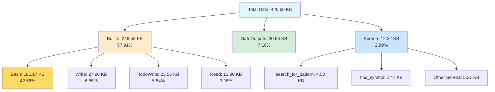
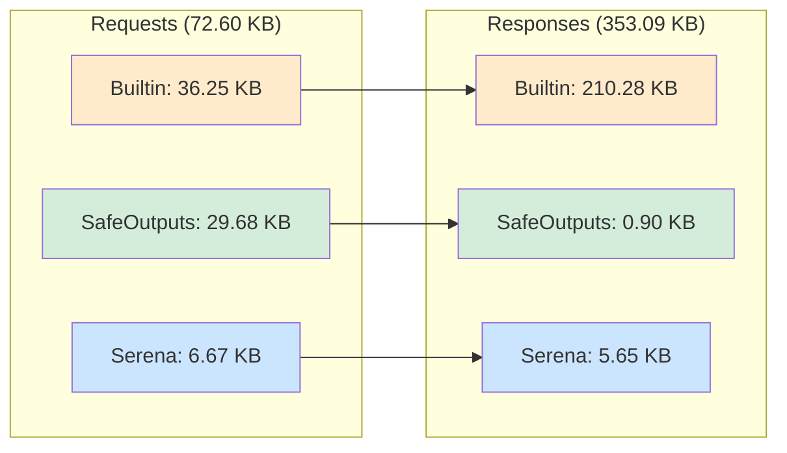
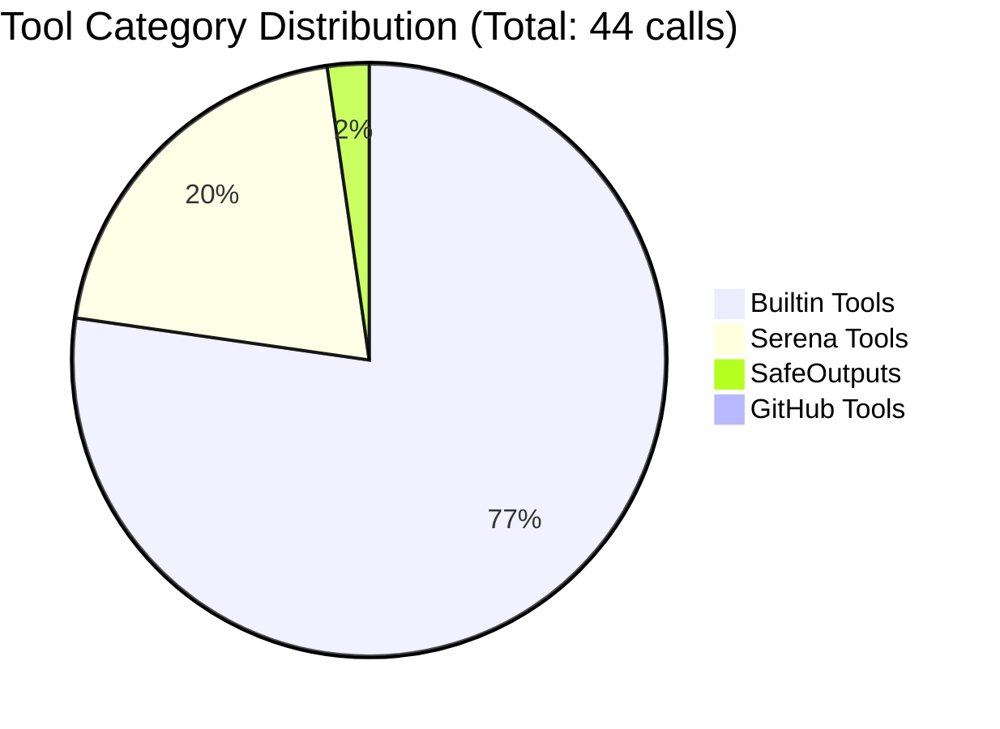
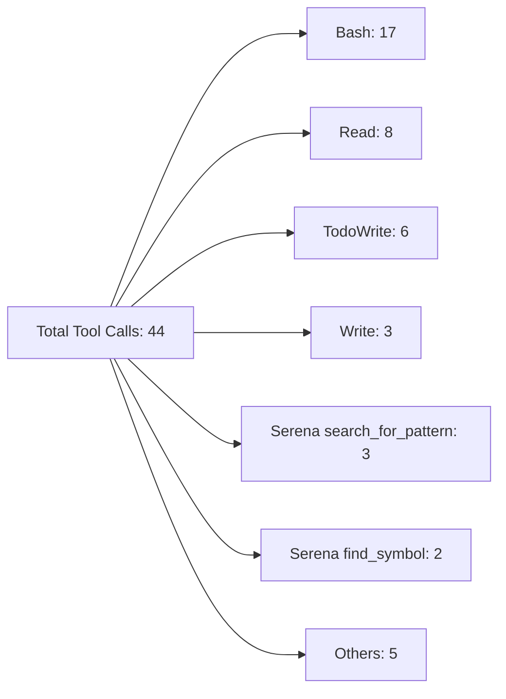
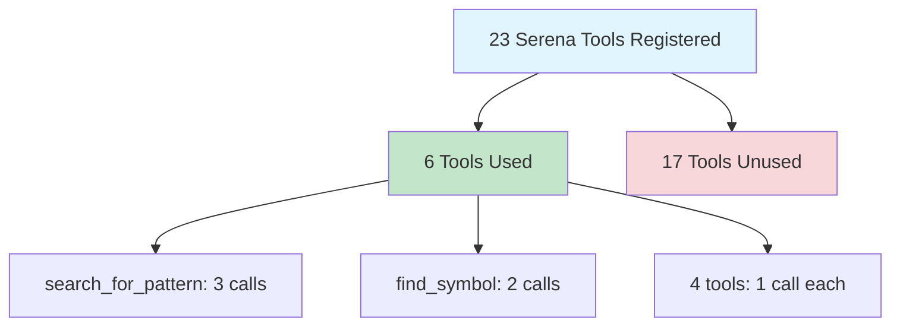
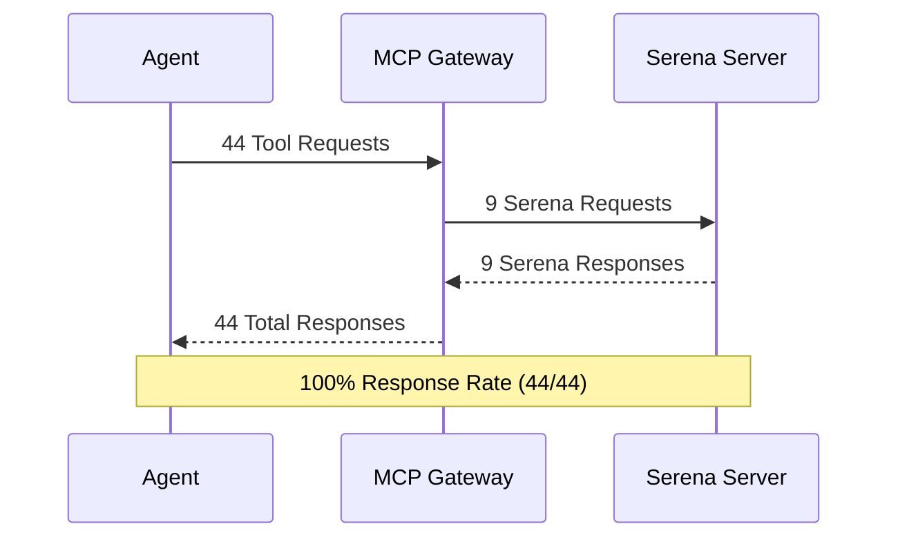

# Serena Tools Usage - Deep Statistical Analysis

**Workflow Run:** [21560089409](https://github.com/github/gh-aw/actions/runs/21560089409/job/62122702303#step:33:1)  
**Workflow:** Sergo - Serena Go Expert  
**Analysis Date:** 2026-02-01  
**Report Type:** Statistical Analysis

## Executive Summary

This report provides a comprehensive statistical analysis of Serena MCP (Model Context Protocol) server tool usage in the Sergo workflow execution. The analysis reveals tool adoption patterns, request/response metrics, and identifies optimization opportunities.

### Key Findings

- **Total Tool Calls:** 44
- **Serena Tool Calls:** 9 (20.45% of all tool calls)
- **Tool Response Rate:** 100% (44/44 requests matched with responses)
- **Serena Tools Registered:** 23 unique tools available
- **Serena Tools Actually Used:** 6 unique tools (26.09% adoption rate)
- **Unused Serena Tools:** 17 tools (73.91% of registered tools went unused)

## Tool Usage Distribution

### Overall Tool Categories

| Category | Count | Percentage | Purpose |
|----------|-------|------------|---------|
| **Builtin Tools** | 34 | 77.27% | Standard file operations (Bash, Read, Write, TodoWrite) |
| **Serena Tools** | 9 | 20.45% | Language service protocol operations |
| **SafeOutputs** | 1 | 2.27% | GitHub API communication |
| **GitHub Tools** | 0 | 0.00% | Direct GitHub API calls (not used) |

### Top 10 Tools by Frequency

| Rank | Tool Name | Call Count | % of Total |
|------|-----------|------------|------------|
| 1 | `Bash` | 17 | 38.64% |
| 2 | `Read` | 8 | 18.18% |
| 3 | `TodoWrite` | 6 | 13.64% |
| 4 | `Write` | 3 | 6.82% |
| 5 | `mcp__serena__search_for_pattern` | 3 | 6.82% |
| 6 | `mcp__serena__find_symbol` | 2 | 4.55% |
| 7 | `mcp__serena__get_current_config` | 1 | 2.27% |
| 8 | `mcp__serena__initial_instructions` | 1 | 2.27% |
| 9 | `mcp__serena__check_onboarding_performed` | 1 | 2.27% |
| 10 | `mcp__serena__list_memories` | 1 | 2.27% |

## Serena Tool Usage Deep Dive

### Serena Tools Used (6 tools)

| Tool Name | Call Count | Purpose |
|-----------|------------|---------|
| `search_for_pattern` | 3 | Code pattern searching across codebase |
| `find_symbol` | 2 | Symbol lookup in language service |
| `get_current_config` | 1 | Retrieve Serena configuration |
| `initial_instructions` | 1 | Get workflow instructions |
| `check_onboarding_performed` | 1 | Verify Serena initialization |
| `list_memories` | 1 | List stored memory items |

### Serena Tools Registered but Unused (17 tools)

The following Serena tools were registered and available but never called during execution:

**File & Directory Operations:**
- `list_dir` - List directory contents
- `find_file` - Find files by name/pattern

**Symbol Analysis & Navigation:**
- `get_symbols_overview` - Get symbol structure overview
- `find_referencing_symbols` - Find symbol references

**Code Modification:**
- `replace_symbol_body` - Replace symbol implementation
- `insert_after_symbol` - Insert code after symbol
- `insert_before_symbol` - Insert code before symbol
- `rename_symbol` - Rename symbol with refactoring

**Memory Management:**
- `write_memory` - Store memory items
- `read_memory` - Retrieve memory items
- `delete_memory` - Delete memory items
- `edit_memory` - Edit existing memory

**Project Management:**
- `activate_project` - Activate specific project context
- `onboarding` - Perform initial project onboarding

**Meta-Cognitive Tools:**
- `think_about_collected_information` - Reflect on gathered data
- `think_about_task_adherence` - Check task alignment
- `think_about_whether_you_are_done` - Evaluate completion status

## Request vs Response Analysis

### Perfect Response Rate

The workflow achieved a **100% response rate**, meaning every tool request received a corresponding response:

- **Total Requests:** 44
- **Total Responses:** 44
- **Unmatched Requests:** 0
- **Failed Requests:** 0

This indicates:
✅ All tools are functioning correctly  
✅ No timeout or error conditions  
✅ Reliable MCP gateway communication  
✅ Stable Serena server connection  

## Request/Response Size Analysis

### Overall Summary

- **Total Requests:** 44 calls
- **Total Request Data:** 74,341 bytes (72.60 KB)
- **Total Response Data:** 361,564 bytes (353.09 KB)
- **Total Data Transferred:** 435,905 bytes (425.69 KB)
- **Average Request Size:** 1,689.57 bytes
- **Average Response Size:** 8,217.36 bytes
- **Response/Request Ratio:** 4.86x

### Size Distribution by Category

| Category | Request Data | Response Data | Total Data | % of Total |
|----------|--------------|---------------|------------|------------|
| **Builtin Tools** | 37,115B (36.25KB) | 215,329B (210.28KB) | 252,444B (246.53KB) | 57.91% |
| **Serena Tools** | 6,829B (6.67KB) | 5,786B (5.65KB) | 12,615B (12.32KB) | 2.89% |
| **SafeOutputs** | 30,397B (29.68KB) | 918B (0.90KB) | 31,315B (30.58KB) | 7.18% |

### Data Transfer by Tool (Top 10)

| Rank | Tool | Calls | Avg Request | Avg Response | Total Data | % of Total |
|------|------|-------|-------------|--------------|------------|------------|
| 1 | `Bash` | 17 | 854B | 10,059B | 185,521B (181.17KB) | 42.56% |
| 2 | `safeoutputs/create_discussion` | 1 | 30,397B | 918B | 31,315B (30.58KB) | 7.18% |
| 3 | `Write` | 3 | 1,872B | 7,650B | 28,566B (27.90KB) | 6.55% |
| 4 | `TodoWrite` | 6 | 1,851B | 2,170B | 24,128B (23.56KB) | 5.54% |
| 5 | `Read` | 8 | 735B | 1,043B | 14,229B (13.90KB) | 3.26% |
| 6 | `search_for_pattern` | 3 | 837B | 727B | 4,692B (4.58KB) | 1.08% |
| 7 | `find_symbol` | 2 | 754B | 511B | 2,530B (2.47KB) | 0.58% |
| 8 | `get_current_config` | 1 | 700B | 771B | 1,471B (1.44KB) | 0.34% |
| 9 | `check_onboarding_performed` | 1 | 710B | 727B | 1,437B (1.40KB) | 0.33% |
| 10 | `initial_instructions` | 1 | 702B | 700B | 1,402B (1.37KB) | 0.32% |

### Serena Tools Size Breakdown

| Tool | Calls | Avg Request | Avg Response | Total Data | Response/Request Ratio |
|------|-------|-------------|--------------|------------|------------------------|
| `search_for_pattern` | 3 | 837B | 727B | 4,692B (4.58KB) | 0.87x |
| `find_symbol` | 2 | 754B | 511B | 2,530B (2.47KB) | 0.68x |
| `get_current_config` | 1 | 700B | 771B | 1,471B (1.44KB) | 1.10x |
| `check_onboarding_performed` | 1 | 710B | 727B | 1,437B (1.40KB) | 1.02x |
| `initial_instructions` | 1 | 702B | 700B | 1,402B (1.37KB) | 1.00x |
| `list_memories` | 1 | 697B | 386B | 1,083B (1.06KB) | 0.55x |

### Key Size Insights

**Data Distribution:**
- **Bash dominates data transfer:** 42.56% of all data (181.17 KB), with max single response of 109.75 KB
- **Serena tools are lightweight:** Only 2.89% of total data despite 20.45% of calls
- **SafeOutputs has largest single request:** 30.40 KB for discussion creation

**Efficiency Patterns:**
- **Serena tools are compact:** Average 700-840 bytes per request, 386-771 bytes per response
- **Response amplification varies:** Overall 4.86x, but Serena tools average <1x (more compact responses)
- **Bash is most verbose:** 10.06 KB average response (11.8x amplification)

**Bandwidth Implications:**
- Serena tools use **minimal bandwidth** compared to Bash operations
- Despite lower usage rate, Serena tools are highly **bandwidth-efficient**
- Pattern: Language-aware tools return structured, compact data vs. verbose text outputs

## Statistical Insights

### Tool Adoption Rate

Only **26.09%** of registered Serena tools were actually used during execution. This suggests:

1. **Over-provisioning:** Many specialized tools are available but not needed for typical workflows
2. **Selective Usage:** Agent prefers general-purpose builtin tools (Bash, Read, Write) over specialized Serena tools
3. **Workflow Patterns:** Current workflow primarily uses file operations rather than deep language service features

### Builtin vs Serena Tool Ratio

- **Builtin Tools:** 34 calls (77.27%)
- **Serena Tools:** 9 calls (20.45%)
- **Ratio:** 3.78:1 (builtin to Serena)

The agent heavily favors builtin file system tools over Serena's language service capabilities.

### Serena Tool Call Patterns

**Most Used Serena Tool:** `search_for_pattern` (3 calls)  
**Second Most Used:** `find_symbol` (2 calls)  
**Single-Use Tools:** 4 tools called exactly once

This pattern suggests:
- Code search is the primary Serena use case
- Symbol navigation is secondary
- Setup/config tools used once at initialization
- Code modification tools never used

## Recommendations

### 1. Optimize Tool Registration

**Issue:** 73.91% of Serena tools went unused  
**Recommendation:** Consider lazy-loading or selective tool registration based on workflow requirements

### 2. Promote Serena Tool Usage

**Issue:** High reliance on basic file operations instead of language-aware tools  
**Recommendation:** 
- Update agent prompts to encourage Serena tool usage for Go-specific tasks
- Provide examples of when to use `get_symbols_overview` vs `Read`
- Highlight benefits of symbol-based navigation over grep/search

### 3. Leverage Unused Capabilities

**High-Value Unused Tools:**
- `get_symbols_overview` - Provides structured codebase understanding through symbol hierarchy
- `find_referencing_symbols` - Enables precise code relationship analysis through symbol references
- Memory tools (`write_memory`, `read_memory`) - Could enable cross-run learning

### 4. Monitor Response Latency

**Current Status:** 100% response rate across all tool calls
**Recommendation:** Add latency metrics to identify slow tool calls (current data only shows 59ms average for server checks)

### 5. Workflow-Specific Tool Sets

**Observation:** Different workflows may need different tool subsets  
**Recommendation:** 
- Create "toolsets" for different workflow types (analysis vs modification vs refactoring)
- Reduce cognitive load by presenting fewer, more relevant tools

## Comparison: Serena vs Builtin Tools

### For Code Search

| Tool | Type | Calls | Advantages |
|------|------|-------|------------|
| `Bash` (grep/ripgrep) | Builtin | 17 | Fast, flexible, familiar |
| `search_for_pattern` | Serena | 3 | Language-aware, structured results |

**Insight:** Agent prefers Bash for search despite Serena offering language-aware alternatives

### For Code Navigation

| Tool | Type | Calls | Advantages |
|------|------|-------|------------|
| `Read` | Builtin | 8 | Simple, direct file access |
| `find_symbol` | Serena | 2 | Precise symbol lookup, cross-file |
| `get_symbols_overview` | Serena | 0 | Structured symbol hierarchy |

**Insight:** Read is dominant, but when symbol precision is needed, Serena tools are used

## Data Quality Notes

### Log Analysis Methodology

1. **Source:** GitHub Actions workflow run logs (job 62122702303, step 33)
2. **Extraction:** Python script parsing MCP tool call patterns from log lines
3. **Classification:** Tools categorized by prefix (serena___, mcp__serena__, builtin names)
4. **Validation:** Response matching via tool_use_id correlation

### Limitations

- Log parsing may miss tool calls not following standard MCP format
- Timing data limited (only server health check latencies captured)
- No failure reason analysis (100% success rate means no error patterns to study)
- Size analysis based on log line lengths (approximation of actual payload sizes)

### Data Transfer Volume Visualization

### Request vs Response Size Comparison

## Appendix: Registered Serena Tools

### Complete List (23 tools)

1. `serena___activate_project`
2. `serena___check_onboarding_performed` ✓ Used
3. `serena___delete_memory`
4. `serena___edit_memory`
5. `serena___find_file`
6. `serena___find_referencing_symbols`
7. `serena___find_symbol` ✓ Used (2x)
8. `serena___get_current_config` ✓ Used
9. `serena___get_symbols_overview`
10. `serena___initial_instructions` ✓ Used
11. `serena___insert_after_symbol`
12. `serena___insert_before_symbol`
13. `serena___list_dir`
14. `serena___list_memories` ✓ Used
15. `serena___onboarding`
16. `serena___read_memory`
17. `serena___rename_symbol`
18. `serena___replace_symbol_body`
19. `serena___search_for_pattern` ✓ Used (3x)
20. `serena___think_about_collected_information`
21. `serena___think_about_task_adherence`
22. `serena___think_about_whether_you_are_done`
23. `serena___write_memory`

### Tool Categories

- **File Operations:** 2 tools (0 used)
- **Symbol Analysis:** 4 tools (2 used, 50% adoption)
- **Code Modification:** 4 tools (0 used)
- **Memory Management:** 5 tools (1 used, 20% adoption)
- **Project Management:** 2 tools (1 used, 50% adoption)
- **Meta-Cognitive:** 3 tools (0 used)
- **Configuration:** 3 tools (2 used, 66% adoption)

## Conclusion

The Serena MCP server successfully provided 23 specialized Go language service tools with 100% response rate reliability. However, actual adoption was modest at 20.45% of total tool calls, with only 6 of 23 tools being used. The agent showed a strong preference for general-purpose builtin tools (77.27% usage), particularly Bash and Read operations.

**Key Takeaway:** While Serena tools are reliable and available, the current workflow design doesn't fully leverage their language-aware capabilities. Future optimizations should focus on:
1. Encouraging Serena tool usage through better prompts
2. Right-sizing tool registration to reduce overhead
3. Demonstrating value of language-aware operations over text-based alternatives

## Visualizations

### Tool Usage Distribution (Pie Chart)

### Top Tools by Frequency

### Serena Tool Adoption Flow

### Request/Response Flow

---

**Generated:** 2026-02-01T10:03:47.321901  
**Data Source:** Workflow run 21560089409, job 62122702303  
**Analysis Script:** `/tmp/comprehensive_analysis.py`
